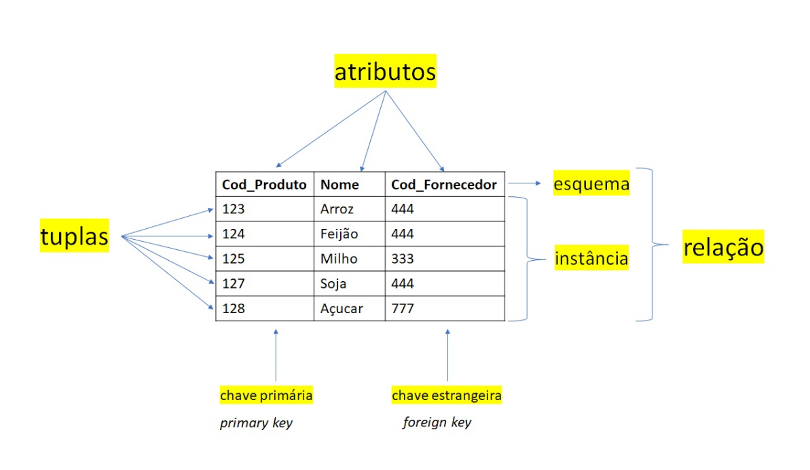

| Cod_Produto | Nome   | Cod_Fornecedor |
| ----------- | ------ | -------------- |
| 123         | Arroz  | 444            |
| 124         | Feijao | 444            |
| 125         | Milho  | 333            |
| 127         | Soja   | 444            |
| 128         | Acucar | 777            |
- Cada coluna da Tabela é chamado de **Atributo**
- Cada linha da Tabela é chamada de **Tuplas**
- A primeira linha da tabela é chamada de **Esquema**
- As N linhas da tabela são chamadas de **Instâncias**
- O conjunto entre *Esquema* e *Instâncias* é chamado de **Relação**
- Geralmente, O primeiro atributo de uma tabela é a **Chave Primaria (Primary Key)**. Nessa caso o *Cod_Produto*
- O Atributo que faz tem ligação com outra tabela é chamado de **Chave estrangeira (Foreign Key)**. Nessa caso o *Cod_Fornecedor*
-  
