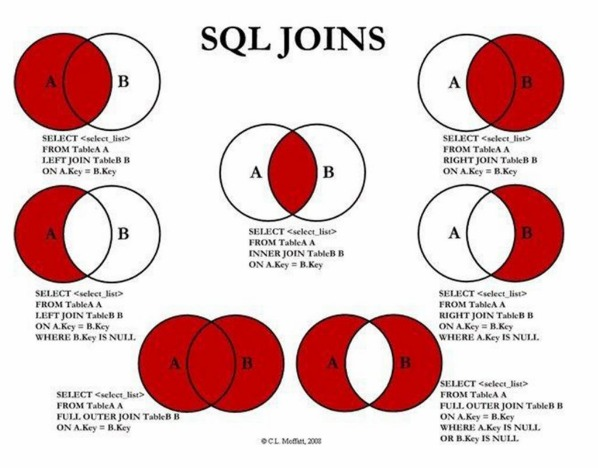

## Estrutura
```
SELECT [DISTINCT] colunas... 
FROM tabela [JOIN tipo ON condicao] 
WHERE condicao_filtragem 
GROUP BY colunas_agrupamento 
HAVING condicao_agrupamento 
ORDER BY colunas_ordenacao 
LIMIT contagem 
OFFSET deslocamento;
```

---
## Comandos
- `SELECT` -> Seleciona um atributo da tabela.
- `SELECT *` -> Seleciona todos os atributos da Tabela.
- `SELECT DISTINCT <Atributo>` -> Se esse atributo tiver tuplas repetidas, ele seleciona apenas uma.
- `FROM <Tabela>`  -> Especifica a tabela principal da qual os dados serão lidos.
- `WHERE <Condicao>` -> Filtra linhas que não atendem a uma condição booleana (`TRUE`/`FALSE`).
- `GROUP BY <Atributo>` -> Agrupa múltiplas linhas em uma única linha, com base em valores de coluna. Essencial para usar funções de agregação.
- `ORDER BY <Atributo>` -> Ordena o resultado do SELECT com base em algum atributo. Se nao tiver nada depois do atributo vai ordenar de forma *Crescente* se tiver **DESC** ordena de forma decrescente.
- `LIMIT <Contagem>` -> Restringe a consulta a um número máximo de linhas a serem retornadas.
- `LIMIT <Contagem> OFFSET <Deslocamento>` -> Alem de restringir a consulta a um numero de linhas ele pula uma quantidade especifica de linhas.
---
## Funções Principais

### Funções de Agregação

- `COUNT(coluna)` -> Conta o número de valores não nulos em uma coluna. `COUNT(*)` conta todas as linhas.
- `SUM(coluna)` -> Soma todos os valores numéricos em uma coluna.
- `AVG(coluna)`	-> Calcula a média de todos os valores numéricos.
- `MAX(coluna)` -> Encontra o maior valor em uma coluna.
- `MIN(coluna)` -> Encontra o menor valor em uma coluna.
- `GROUP_CONCAT(coluna)` -> Concatena valores de múltiplas linhas em uma única string.

### Funções Escalares (operam em cada linha)

**Texto:**
- `LOWER(str)`: Converte para minúsculas.
- `UPPER(str)`: Converte para maiúsculas.
- `TRIM(str)`: Remove espaços em branco do início e do fim.
- `LENGTH(str)`: Retorna o número de caracteres.
- `SUBSTR(str, start, len)`: Extrai uma parte da string.
- `REPLACE(str, find, replace)`: Substitui texto dentro de uma string.

**Data e Hora:**
- `DATE(time_string)`: Extrai a data (ex: '2025-09-12').
- `TIME(time_string)`: Extrai a hora (ex: '20:07:37').
- `DATETIME(time_string)`: Retorna data e hora completas.
- `STRFTIME(format, time_string)`: Formata uma data/hora de acordo com um padrão (ex: `STRFTIME('%d/%m/%Y', 'now')`).

**Condicionais e Utilitárias:**
- `CASE WHEN ... THEN ... ELSE ... END`: Estrutura condicional (if/else) para retornar valores diferentes com base em condições.
- `COALESCE(val1, val2, ...)`: Retorna o primeiro valor não NULO da lista. Perfeito para tratar dados ausentes.
- `ROUND(num, digits)`: Arredonda um número.
- `ABS(num)`: Retorna o valor absoluto de um número.

---
## JOIN 

#### Combina dados de duas ou mais Tabelas.
- `INNER JOIN`: Retorna apenas as linhas que têm correspondência em **ambas** as tabelas.
- `LEFT JOIN`: Retorna **todas** as linhas da tabela da esquerda e as linhas correspondentes da tabela da direita. Se não houver correspondência, as colunas da direita virão como `NULL`.
- `RIGHT JOIN`: Retorna **todas** as linhas da tabela da direita e as linhas correspondentes da tabela da esquerda. Se não houver correspondência, as colunas da direita virão como `NULL`.
- `FULL OUTER JOIN`: Retorna todas as linhas das duas tabelas. Se não houver correspondência, as colunas virao `NULL`.

#### EX:
- Tabela Medico

| codigo | nome             | email              | CRM     | codcid |
| ------ | ---------------- | ------------------ | ------- | ------ |
| 1      | Paulo Rangel     | pr@eee.ccc.br      | 23453   | 1      |
| 2      | Ana Maria        | am@eee.ccc.br      | 555453  | 5      |
| 3      | José Paulo       | jpo@eee.ccc.br     | 677755  | 6      |
| 4      | Carla Ana        | nena@eee.ccc.br    | 987666  | 4      |
| 5      | Nena Lina        | nena@eee.ccc.br    | 245543  | 7      |
| 6      | Paulina Tirou    | tirou@eee.ccc.br   | 2564555 | 9      |
| 7      | Luara dos Santos | lua@eee.ccc.br     | 983456  | 1      |
| 8      | Luan dos Santos  | lsantos@eee.ccc.br | 89898   | 1      |
| 9      | Carla Ana        | luan.santos@...    | 4545454 | 5      |
| 110    | Carolina Pereira | cp@a.bcd.efg       |         | 1      |
 - Tabela Consulta
 
| data     | hora     | codpac | codmed | valor | codconv |
| -------- | -------- | ------ | ------ | ----- | ------- |
| 2/20/06  | 10:00:00 | 1      | 3      | 100   | 1       |
| 2/21/06  | 11:00:00 | 3      | 2      | 100   | 1       |
| 2/22/06  | 14:00:00 | 4      | 3      | 100   | 1       |
| 2/23/06  | 13:00:00 | 5      | 4      | 50    | 2       |
| 2/20/05  | 15:00:00 | 6      | 2      | 100   | 1       |
| 2/21/05  | 16:00:00 | 4      | 1      | 30    | 3       |
| 3/20/06  | 17:00:00 | 7      | 2      | 44    | 3       |
| 3/21/06  | 09:00:00 | 3      | 1      | 100   | 1       |
| 3/21/06  | 09:00:00 | 2      | 7      | 100   | 1       |
| 3/21/06  | 9:00:00  | 6      | 7      | 100   | 1       |
| 3/21/02  | 9:00:00  | 6      | 7      | 122   | NULL    |
| 10/20/04 | 15:00:00 | 6      | 3      | 120   | NULL    |

- Nesse caso codigo e a Primary Key da tabela medico e o codmed e a Foreign Key que se relaciona com ela 

```
SELECT DISTINCT M.nome
FROM Medico M
LEFT JOIN Consulta C ON M.codigo = C.codmed
WHERE M.codcid = 1;
```
- Mesmo os codigo de medico 8 e 110 nao estarem presentes na tabela Consulta, ele retorna o nome desse medicos devido ao LEFT JOIN

```
SELECT DISTINCT M.nome
FROM Medico M
RIGHT JOIN Consulta C ON M.codigo = C.codmed
WHERE M.codcid = 1;
```
- Nesse caso como e RIGHT JOIN, ele retorna apenas os nomes dos medicos que os codigo estao presentes na tabela Consulta

---
## Consultas Aninhadas 

Uma consulta `SELECT` aninhada dentro de outra consulta. Pode ser usada em cláusulas como `SELECT`, `FROM` ou `WHERE`.
```
-- Encontrar funcionários que ganham mais que a média salarial 
SELECT nome, salario 
FROM Funcionarios 
WHERE salario > (SELECT AVG(salario) FROM Funcionarios);

```

---
## Ordem de Execucao

| Ordem | Clausula | Parametro                             |
| ----- | -------- | ------------------------------------- |
| 1.    | FROM     | `<Tabela (s)>`                        |
| 2.    | WHERE    | `<Condicao (oes) sobre atributo (s)>` |
| 3.    | GROUP BY | `<Atributo (s)>`                      |
| 4.    | HAVING   | `<Condicao (oes) sobre funcao (oes)>` |
| 5.    | SELECT   | `<Atributo (s) e/ou funcao (oes)>`    |
| 6.    | ORDER BY | `<Atributo (s)>`                      |
