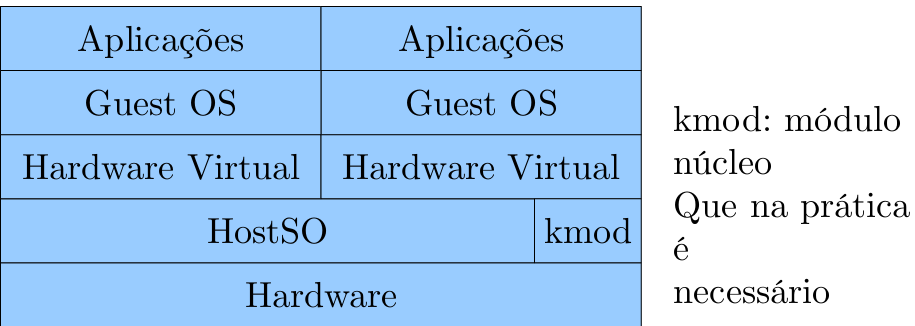

Sistema Operacional é um programa ou conjunto de programas.
- Visão Geral de um Sistema Computacional:

**Modo Protegido não é modo administrador ou modo usuário. Ele é ainda mais forte e restrito.**

- **Tanenbaum:** a maioria dos SOs possuem dois modos de operação: modo protegido (kernel) e modo usuário.
- Algumas instruções são utilizadas para controlar o hardware, como instruções de entrada e saída, que fazem modificação no disco rígido, por exemplo.
- No modo usuário, algumas instruções são proibidas de executar( instruções privilegiadas).
---
## Definição:

- O SO é a parte fundamental de software que executa em modo protegido, onde possui acesso a todo hardware e pode executar qualquer instrução que a máquina é capaz de executar.
- Um SO não é executado de forma linear como na maioria das aplicações, como início, meio e fim.
- Suas rotinas são executadas concorrentemente em função de eventos assíncronos(que podem ocorrer a qualquer momento).
---
## Qual a função de um SO

- O SO é o gerenciador de recursos da máquina.
- O SO fornece ao usuário uma visão de sua interface com a máquina.
- Um SO possui duas grandes funções: 
	- Criar para o usuário uma **abstração do hardware**.
	- **Gerenciar os recursos** da máquina.
---
## Máquina Estendida

- O sistema operacional apresenta ao usuario uma maquina estendida, mais simples de programar que a maquina real.
	- Tambem chamada de maquina abstrata, ela é equivalente ao hardware, mas mais simples de manipular.
- Leitura de arquivo em disco.
- *Hardware*: verificar a rotação do HD, posicionar o cabeçote na trilha correta, realizar operação de leitura e escrita, etc.
- Máquina estendida: aceita chamadas
	- `fp = fopen(...)`;
	- `fread(fp,...)`;
- Além disso, existem dezenas de informações que influenciam: sistemas de arquivos(ext4, NTFS).
- Se o programador tivesse que se preocupar com todos esses detalhes, existiriam pouquissimos programas portáteis.
- A função do sistema operacional de máquina estendida esconde tal complexidade do hardware, protegendo programadores e usuários.
---
## Gerenciador de Recursos

- O computador é um conjunto de recursos que serão compartilhados:
	- Físicos: Processadores, memorias, discos, rede, ...
	- Abstratos: processos, arquivos, ...
- O SO deve proteger esses recursos, especialmente em ambientes com múltiplos usuários, de forma que não interfiram uns nos outros.
- Exemplos típicos de gerenciador de recursos:
	- Uso de CPU: um programa pode usar a CPU durante um tempo, porém após um determinado período o SO deve permitir que outro programa execute.
	- Uso de memória: um programa deve ser terminado caso altere uma região de memória que não lhe pertence.
- Para todos recurso, o SO deve:
	- Manter informações sobre o recurso(endereço, estado, etc);
	- Decidir quem pode acessar o recurso;
	- Alocar e liberar o recurso;
- É desejável no gerenciamento de recursos:
	- Ser eficiente, maximizando a utilização de recursos
	- Possuir um tempo de resposta previsível;
---
## História Dos Sistemas Operacionais

- A evolução dos SOs está intimamente ligada à evolução dos computadores e suas principais formas de uso.
- A evolução dos computadores é separada em décadas
	- **Máquina Analítica:** 
		- Foi o primeiro computador digital projetado por Charles Babbage, nunca foi implementados pois ela era puramente mecânica e a tecnologia da epoca não permitia a criação de mecanismos precisos.
	- **Primeira Geração** (1945-1955): 
		- Computadores a válvula. 
		- O primeiro funcional foi criado na Universidade de Iowa com 300 válvulas. 
		- Eram muito primitivos. 
		- Toda programação era feita em codigo de maquina absoluta, ou ligando diretamente circuitos elétricos. 
		- Não havia conceito de linguagem de programação, nem sistemas operacionais.
	- **Segunda Geração** (1955-1965): 
		- Substituição das válvulas por transistores.
		- Diferenciação dos papéis dos projetistas, construtores, operadores, programadores e manutenção.
		- Eram máquinas de grande porte (mainframes) e ficavam isolados em grandes salas climatizadas.
		- Apenas grandes corporações e governos tinham acesso à essas máquinas.
		- Para executar uma tarefa, um programador escrevia o programa em um papel e perfurava cartões.
		- Ele levava os cartões a um operador e então aguardava o resultado(Podia demorar muito).
		- Quando o computador terminava, o operador ia até a impressora e pegava o resultado, armazenando-o em uma das salas para que o programador pudesse pegá-la.
		- Surgiu os sistemas de lote (batch) para economizar recursos e diminuir o tempo.
		- Reunir em um lote de tarefas na sala de entrada e então passa-lo para uma fita magnética. usando um computador pequeno e relativamente barato.
		- A computação real era utilizando um computador mais caro e completo.
		- Essa fita magnética era carregada em um programa que lia a primeira tarefa da fita e então a executava, armazenando a saída em uma segunda fita.
		- O sistema operacional era responsável por ler a tarefa das fitas, executar, e ao término da tarefa ler a próxima tarefa da lista.
		- Dessa forma, as tarefas eram executadas sequencialmente.
		- Esses grandes computadores da segunda Geração foram amplamente utilizados para cálculos científicos e de engenharia.
	- **Terceira Geração** (1965-1980):
		- No inicio da década de 1960, existiam duas linhas de computadores: 
			- Computadores de grande porte, científicos de grande escala, orientados a palavras.
			- Computadores comerciais, orientados a caracteres e impressão de fitas, utilizados por bancos e companhias de seguros.
		- A IBM inovou o mercado com o System/360: uma série de máquinas com software compatíveis.
			- Essas maquinas possuíam uma diferença de preço e desempenho considerável.
			- Todas tinham a mesma arquitetura e conjunto de instrução.
			- A primeira linha utilizou circuitos integrados.
			- O sistema operacional OS/360 funcionava em todos os modelos.
			- Houve um problema para criar software e SOs pois os software tinham que ser compatíveis com todos os modelos, e eram máquinas muito distintas e de diferentes escalas.
		- Os SOs de terceira geração também introduziram um conceito fundamental em todos os sistemas operacionais modernos: a **multiprogramação**.
		- Nessa geração, existia dois processos ativos concorrentemente no sistema operacional.
		- Mas a concorrência era muito primitiva: quando uma tarefa atual fazia uma pausar para esperar uma fita ou outra operação de E/S, a CPU ficava ociosa até o término da E/S.
		- A solução encontrada foi dividir a memória em várias partes, com uma tarefa diferente em cada partição:
			- 
			- Enquanto uma tarefa aguardava uma operação de E/S a outra poderia avançar.
			- Para isso, foram necessária modificações no hardware para proteger partições contra transgressões ou bugs das outras.
		- Outro aspecto adicionado a essa geração foi a capacidade de transferir tarefas de cartões para discos.
		- Sempre que uma tarefa sendo executava terminava, o sistema operacional podia carregá-la do disco para memória e executá-la.
		- Essa técnica é chamada de **spooling**.
		- O spooling é uma técnica que permite acesso para dispositivos muito lentos, armazenando temporiamente dados em uma memória secundária.
		- Hoje em dia, essa técnica ainda é utilizada nas impressoras.
		- Surgiu tambem o conceito de **timesharing**: os usuários poderiam compartilhar a CPU e recursos, sendo que cada um deles tinha direito a usar uma fatia de tempo.
		- Sistema MULTICS teve sucesso com essa técnica.
	- **Quarta Geração** (1980-Atual):
		- Desenvolvimento de circuitos em larga escala (LSI);
		- Popularização dos computadores pessoais;
		- IBM entrou no mercado de microcomputadores pessoais;
		- Intel virou grande referência;
		- Surgiu as primeiras interfaces gráficas como o Windows;
		- Surgiram sistemas operacionais de rede e distribuídos, são SOs que estão conscientes da existência de mais de uma máquina.
		- Primeiros Telefones Moveis;
		- A era dos smartphones (computadores portáteis) com iOS e Android classificaram uma nova geração de sistemas operacionais.
		- Melhora nos sistemas operacionais embarcados como o iOS, Android, BlackBerry OS e Symbiam OS.
		- A maioria dos conceitos fundamentais de SO não foram alterados por essa nova geração
---
## Classificações de sistemas operacionais

- Os SOs podem ser classificados em três categorias:
	- Sistemas Monoprogramáveis / Monotarefa;
	- Sistemas Multiprogramáveis / Multitarefa;
	- Sistemas com Múltiplos Processadores;

#### Sistemas Monoprogramáveis

- SOs voltados à execução de um único programa;
- Processador, memória, periféricos permanecem dedicados à um único programa;
- Possuem a raiz nos computadores da década de 60;
- Ex: MS-DOS da Microsoft;
#### Sistemas Multiprogramáveis

- Os sistemas multiprogramáveis permitem que os recursos computacionais sejam compartilhados entres os diversos usuários e aplicações.
- Enquanto um programa espera um eventos, outros podem utilizar o processamento.
- O sistema operacional é responsável por gerenciar acessos concorrentes aos mesmos recursos.
- Redução no tempo de resposta.
- Sistemas multiporgramáveis:
	- Sistemas Batch;
	- Sistemas de tempo compartilhado;
	- Sistemas de tempo real;
- **Sistemas Batch**:
	- Criados na década de 60, inspirado nos cartões perfurados e fitas magnéticas;
	- Não exige interação do usuário com a aplicação;
	- As aplicações são organizadas e processadas em lote;
-  **Sistemas de tempo compartilhado:**
	- Os sistemas de tempo compartilhado permitem que diferentes programas sejam executados a partir da divisão de tempo do processador em pequenas fatias de tempo (time-slice);
	- Diversas mudanças no SO e no hardware são necessárias para permitir esse comportamento;
	- EX: Windows 98 e Linux 2.4
- **Sistemas de tempo real:**
	- Possuem certas semelhanças ao tempo compartilhado;
	- Porém, o tempo real exige aplicações rígidas de limite de tempo as ser cumprido;
	- Subclassificação em tempo real crítico: caso ocorra grandes prejuízos;
	- EX: Controle de tráfego aéreo, controle de indústria automobilística;

####  Sistemas com Múltiplos Processadores

- Possuem dois ou mais processadores interligados e trabalhando em conjunto;
- Permite vários programas sejam efetivamente executados ao mesmo tempo;
- Permite que um programa seja executado mais rapidamente (se o programa for multithreaded);
- Herdaram vários fundamentos do time-sliced;
- EX: Windows XP e posteriores, Linux 2.6 e posteriores;
---
## Sistemas Operacionais Usuais

- Classificação de alguns sistemas operacionais amplamente utilizados:
	- Sistemas operacionais de computadores pessoais;
	- Sistemas operacionais de Servidores;
	- Sistemas operacionais embarcados;

#### Sistemas operacionais de computadores pessoais:

- Sistemas operacionais comumente utilizados para o uso simultâneo de apenas um usuário;
- Utilizados em computadores de mesa, notebooks;
- Tipicamente, contém um pacote de escritório, com editores de texto, planilhas, etc;
- EX: Windows XP, 7, 8.1, 10 e Ubunto, Fedores, OpenSuse;

#### Sistemas operacionais de Servidores:
- Sistemas cujo objetivo é servir o maior número de usuários ao mesmo tempo;
- Pode incluir diferentes tipos de serviços: servidor web, e-mail, servidor de autenticação, servidor de backup, etc;
- EX: Windows 2008 Server, Windows 2012 Server, Cent OS, Red Hat e Slackware;

#### Sistemas Operacionais Embarcados:
- Sistema muito popular de grande crescimento ultimamente;
- Sistemas operacionais que funcionam em equipamentos que não aparentam ser um computador: micro-ondas, TV, celulares e smartphones;
- EX: PalmOS, Windows CE, Android, iOS, Windows Phone;

---
## Estrutura dos Sistemas Operacionais

- Uma das mais importantes classificações dos SOs é de acordo com a estrutura que seu kernel está organizado;
- Tema de Ampla pesquisa na década de 90;
- Classificação dos SOs em relação a arquitetura:
	- Sistemas Monolíticos;
	- Sistemas em Camadas;
	- Máquinas Virtuais;
	- Micro-Kernel (cliente/servidor);
	- Exo-Kernel;

#### Sistemas Monolíticos

- É a organização de SO mais comum;
- O SO operacional roda em modo protegido, todo restante em modo usuário;
- A estrutura do SO é mantida em organização de código;
- Possui a melhor organização para tempo de resposta;
- Todos os procedimentos do núcleo são visíveis a todos os outros;
- Para se obter uma estrutura: todos os procedimentos são forçados a fazer um SVC (supervisor call). Organização do Unix comercial;
- Possuir três camadas: um procedimento principal que chama os procedimentos de serviço. E procedimentos utilitários, compartilhados entre os de serviço;
- Alguns sistemas monolíticos modernos não incluem todas as possibilidades e serviços no núcleo, pois isso ocupa muito espaço em memória.
- Esses sistemas permitem módulos de kernel, dados existentes no espaço de usuário que são inseridos pelo administrador (root) no kernel;
- EX: ntfs.ko

#### Sistemas em Camadas

- O sistema é organizado em camadas funcionais.
- Cada camada faz uma chamada à camada inferior.
- A noção de camadas é fortemente reforçada pelo hardware.
- Sistema Operacional THE:

| NUM | Camada                                     |
| --- | ------------------------------------------ |
| 5   | Operador                                   |
| 4   | Programas de usuário                       |
| 3   | Gerenciamento de Entrada e Saída           |
| 2   | Comunicação operador e processo            |
| 1   | Gerenciamento de memória e tambor          |
| 0   | Alocação de processador e multiprogramação |

#### Micro-Kernel

- Modelo Cliente-Servidor.
- A maior parte das funções do SO é implementada a nível de usuário (Processos clientes);
- O núcleo é visto como um servidor para os clientes, implementando a abstração de processos e comunicação entre eles;
- Falha em um servidor de arquivos não afeta o kernel;
- Os processos interagem com SO através de troca de mensagens;
- Alta adaptabilidade a sistemas distribuídos;
- Algumas partes de SO é impossível implementar esse esquema: carregar comando nos registradores físicos;
- Difícil implementação, mas relativa popularidade no meio;
- Sistema Operacional Distribuído Mach:
- 

#### Máquinas virtuais

- Os sistemas operacionais estruturados como máquinas virtuais possuem, no mais baixo nível, um monitor de máquina virtual;
- Monitor de máquina virtual é executado pelo hardware;
- Em cima do monitor, várias máquinas virtuais podem ser utilizadas;
- As máquinas virtuais implementam uma cópia do hardware configurável;
- Hipervisor tipo 1 (EX: ESX Server da VMware):
- 
- Monitor de Máquina Virtual é um SO do tipo Máquinas Virtuais;
- Não confundir com uso de um Host SO;
- Hipervisor tipo 2 (EX: VMware Workstation):
- 
- Host SO é um outro tipo de SO (Monolítico, Camadas, etc);

#### EXO-Kernel

- As abordagens de máquina virtual tendem a criar um clone de (partes) da máquina real;
- Uma outra estratégia é dividir: uma máquina virtual recebe blocos de disco de 0 a 1023 e a outra de 1023 a 2047;
- Desta forma, inserimos um software em modo protegido que apenas garante que os recursos são divididos entre os usuários;
- Poupa recursos retirando camada de mapeamento;
- Foco na multiplexação segura do hardware;
- Expõe o hardware às aplicações e ao espaço de usuário;
- Com as primitivas básicas de hardware, podem ser implementadas em modo usuário as abstrações tradicionais do SO;
- O conceito de SO é divido em duas partes:
	- Exo-Kernel: Núcleo minimalista que faz multiplexação segura entre os recursos de hardware, protegendo-os;
	- LibOS(sistemas operacionais biblioteca): conjunto de biblioteca que gerenciam recursos e oferecem abstrações de alto nível para as aplicações;

#### Contêineres

- Um concorrente das máquinas virtuais são os contêineres (EX: Docker, Podman).
- Frequentemente, utiliza-se máquinas virtuais para isolar as aplicações em execução na mesma máquina;
- Mas nesse caso, é necessário simular um SO completo;
- Utilizam namespace, cgroups, selinux para isolar processos, ou seja, usam várias funcionalidades do SO, mas não são SO: rodam em modo usuário (Administrador);
- Os contêiners compartilham o núcleo do sistema operacional
- 
- Fora isso, cada contêiner pode escolher as suas bibliotecas de espaço de usuário;
- As informações dos contêiners são isoladas(sandbox);
- Se existir alguma incompatibilidade entre as bibliotecas, os contêiners não serão afetados;
- Desvantagens: não é possível executar em um SO completamente diferentes do hospedeito;
- Contêiners são isolados a nível de processo: se um contêiner tem permissão de alterar o núcleo do SO e induzir uma instabilidade, ela será compartilhada por todos os contêiners;
---