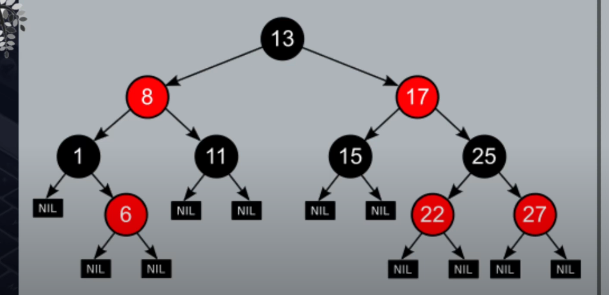
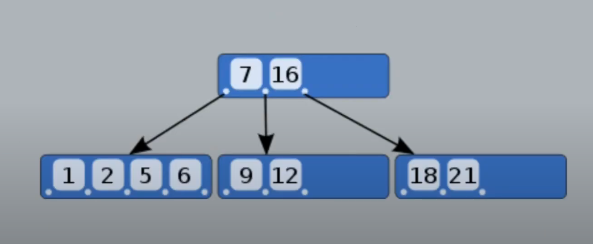
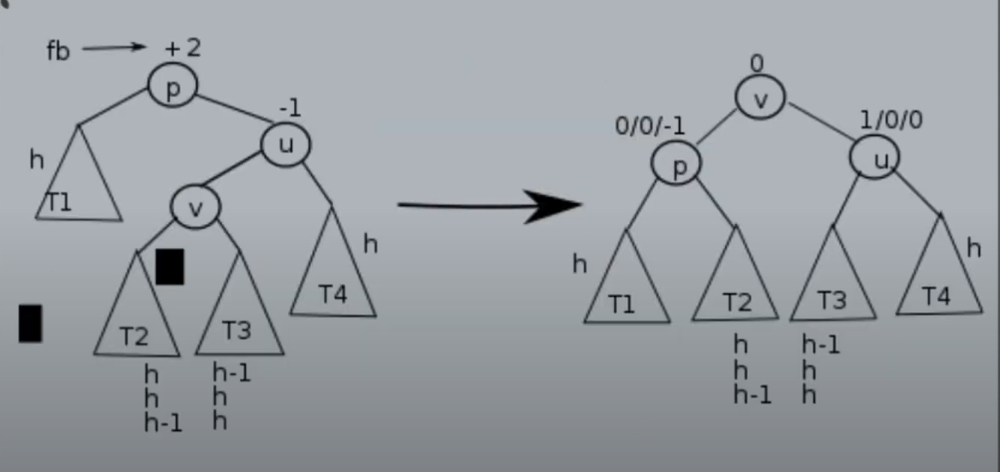
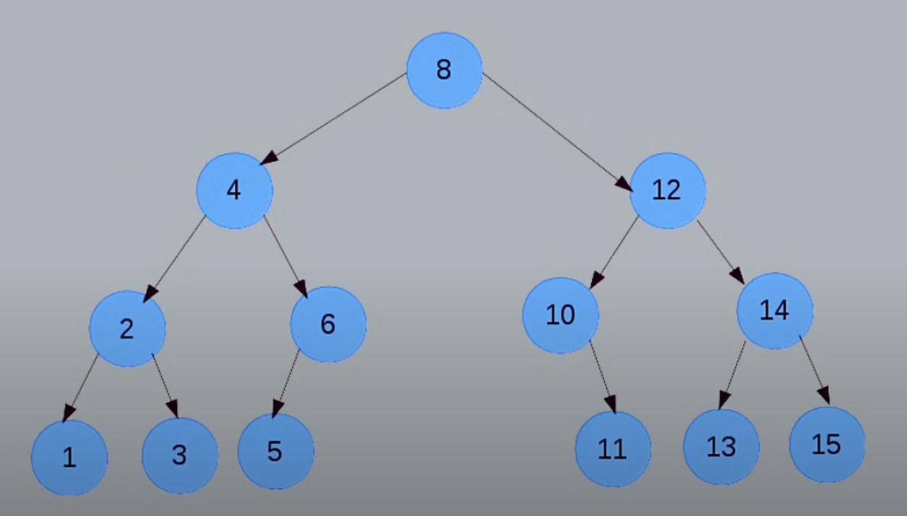
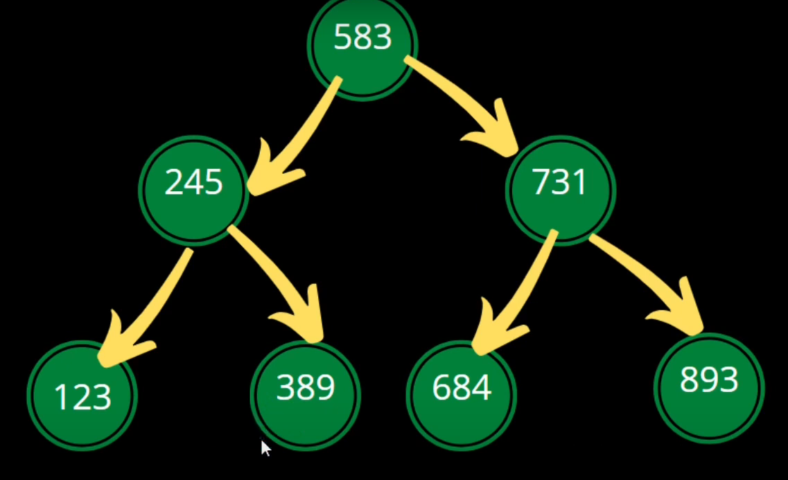
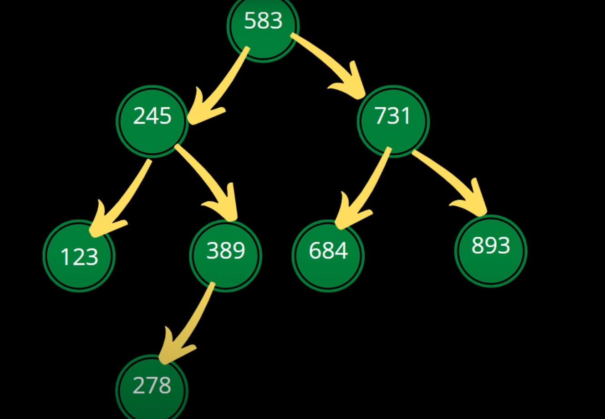
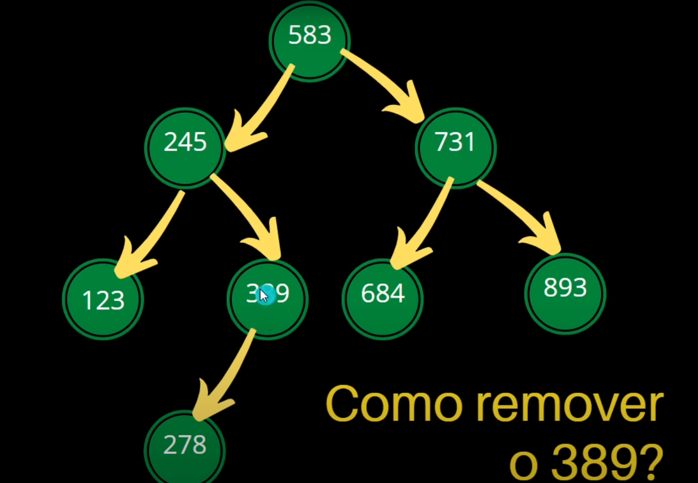
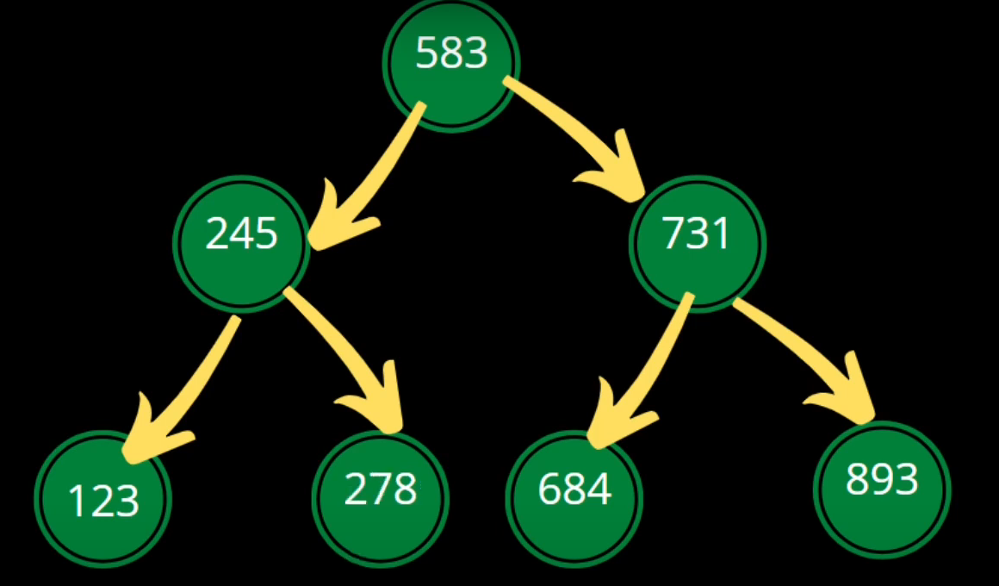
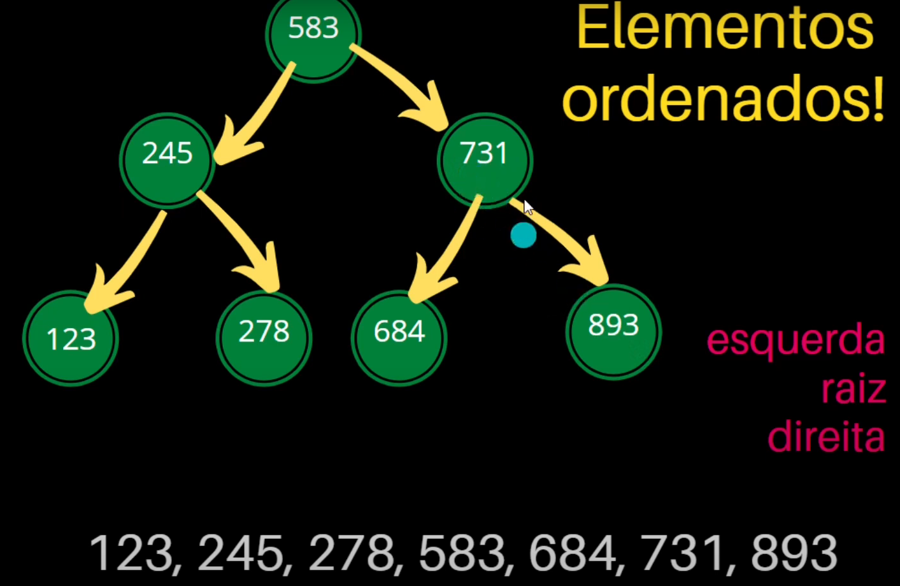

### 1 Introducao
#### 1.1 O que e uma Arvore?

- Estrutura de dados utilizada para organizacao e busca de dados.
- Arvore e implementada em Sistemas de arquivos em sistemas operacionais.
- Disco Rigido tambem usa uma arvore.
---
#### 1.2 Tipos de Arvores

- Arvore Red Black
 


- Arvore B
 


- Arvore AVL
 


- Arvore Binaria



---

### 2. Arvore Binaria De Busca

#### 2.1 Oque e?

- Composta por Nos.
- Os Nos a direita da arvore terao valores maiores que a raiz e os Nos da esquerda terao valores menores que a raiz.
- A estrutura do No possui um valor e ponteiros para os proximos Nos.
- Cada um desse Nos possuem dois ponteiros, um para o No da direita e o outro para o No da esquerda, representando os filhos.
- **Conceitos Importantes**:
	- `Raiz`: No mais ao topo da arvore, inicia a busca por esse no e depois vai percorrendo o resto da arvore.
	- `Filhos`: Nos que estao abaixo de outro, ou seja, a raiz tera 1 ou dois filhos e esses filhos terao mais filhos na arvore.
	- `Folhas`: Nos que nao tem filhos, ou seja, final da arvore.
	- `SubArvore`: Sao as arvores menores dentro da arvore menor.
	- `Altura`: Tamanho do no raiz ate o No mais debaixo da arvore.
---
#### 2.2 Busca

- Comeca a verificar pelo No Raiz, se for menor vai para o No que o ponteiro da esquerda aponta, se for maior vai para o No que o ponteiro da direita aponta. Faz esse processo ate encontrar ou nao o elemento desejado. 
- Se chegar ate um No folha e o elemento ainda nao foi encontrado ele nao esta presente na arvore.
---
#### 2.3 Insercao

- Para inserir um novo No na arvore, ele faz as comparacoes para saber onde esse No sera inserido, quando chegar em um No que aponta para NULL ira apontar esse No para o No que esta sendo inserido.
- Arvore antes de inserir o elemento 278:
 

- Arvore Depois de inserir o elemento 278:
 


---
#### 2.4 Remocao

- Faz a busca do elemento que deseja remover, pega o No que esta apontando para esse elemento e aponta para o proximo No da arvore.
- Arvore antes de Remover o No 389:
 

- Arvore depois que o No foi removido:
 

---

#### 2.5 Printar Elementos da Arvore de Forma Ordenada

- Percorre a arvore de forma recursiva printando o elemento esquerda, raiz e direita, fazendo com que os elementos fiquem de forma ordenada.
 


---

### 3. Implementacao de uma BST

#### Estrutura do No de uma Arvore
```
typedef struct no{
	int valor;
	struct no *direita, *esquerda;
}NoArv;
```
---
#### Funcao de Insercao de um No na arvore:

- Funcao com retorno e Recursao
```
-> A funcao ira retornar um ponteiro; 
-> Tem como parametro o No raiz da arvores e o numero que quer inserir;
NoArv* inserir_versao_1(NoArv *raiz, int num){

	-> Faz a verificacao se a arvore esta vazia
	if(raiz == NULL){
	
	-> Se estiver, aloca um novo No:
		NoArv *aux = malloc(sizeof(NoArv));
	-> O valor desse No vai ser o num:
		aux->valor = num;
	-> Os valores dos ponteiros vao apontar para NULL:
		aux->esquerda = NULL;
		aux->direita = NULL;
	-> Retorna o ponteiro da Arvore que sera o aux:
		return aux;

	-> Se a arvore nao estiver Vazia
	} else{
	
	-> Verifica se o numero e menor que o valor do No Raiz:
		if(num < raiz->valor){
		-> Faz uma recursao ate um No apontar para NULL, assim inserindo:
			raiz->esquerda = inserir_versao_1(raiz->esquerda, num);
			
	-> Verifica se o numero e maior que o valor do No Raiz:
		} else {
		-> Faz uma recursao ate um No apontar para NULL, assim inserindo:
			raiz->direita = inserir_versao_1(raiz->direita, num);
		}
	
	-> Retorna o ponteiro da raiz modificado:
		return raiz;	
	}
}
```

- Funcao sem Retorno:
```
-> Atraves do ponteiro para ponteiro, a funcao ira modificar a arvore diretamente sem retornar nada:
void inserir_versao_2(NoArv **raiz, int num){

	if(*raiz == NULL){
		*raiz = malloc(sizeof(NoArv));
		(*raiz)->valor = num;
		(*raiz)->direita = NULL;
		(*raiz)->esquerda = NULL;		
	} else {
		if(num < (*raiz)->valor){
			inserir_versao_2(&((*raiz)->esquerda), num);
		} else {
			inserir_versao_2(&((*raiz)->direita), num);
		}
	}
}
```

- Funcao sem retorno e sem recursao:
```
void inserir_versao_3(NoArv **raiz, int num){

	NoArv *aux = *raiz;
	while(aux){
		if(num < aux->valor){
			raiz = &aux->esquerda;
		} else {
			raiz = &aux->direita;
		}
		aux = *raiz;
	}
	aux = malloc(sizeof(NoArv));
	aux->valor = num;
	aux->esquerda = NULL;
	aux->direita = NULL;
	*raiz = aux;
}
```
---
#### Funcoes para Imprimir a BST:

- Impressao **PRE-ORDEM**:
`Útil para salvar ou copiar a estrutura da árvore (ex: serialização).`
```
-> Recebe a No raiz da Arvore
void imprimir_versao_1(NoArv *raiz){

-> Se a arvore estiver vazia
	if(raiz){
		printf("%d ", raiz->valor);
		imprimir_versao_1(raiz->esquerda);
		imprimir_versao_1(raiz->direita);
	}
}

EX:
		 50 Raiz
    25         100
	    30
-> Ao chamar essa funcao nesse arvore o retorno sera:
50 25 30 100
```

- Impressao **EM-ORDEM**:
`Imprime os valores em ordem crescente, se a árvore for uma BST.`
```
-> Recebe a No raiz da Arvore
void imprimir_versao_2(NoArv *raiz){

-> Se a arvore estiver vazia
	if(raiz){
		imprimir_versao_1(raiz->esquerda);
		printf("%d ", raiz->valor);
		imprimir_versao_1(raiz->direita);
	}
}

EX:
		 50 Raiz
    25         100
	    30
-> Ao chamar essa funcao nesse arvore o retorno sera:
25 30 50 100
```

- Impressao **POS-ORDEM**:
`Usado quando você quer apagar a árvore ou liberar a memória de forma segura.`
```
-> Recebe a No raiz da Arvore
void imprimir_versao_3(NoArv *raiz){

-> Se a arvore estiver vazia
	if(raiz){
		imprimir_versao_1(raiz->esquerda);
		imprimir_versao_1(raiz->direita);
		printf("%d ", raiz->valor);
	}
}

EX:
		 50 Raiz
    25         100
	    30
-> Ao chamar essa funcao nesse arvore o retorno sera:
30 25 100 50
```
---
#### Busca em um Arvore Binaria

- **Busca usando Recursao**:
```
-> Retorna um ponteiro
-> Recebe o ponteiro no No raiz e o numero que quer encontrar
NoArv* buscar_versao_1(NoArv *raiz, int num){

-> Verifica se a arvore esta vazia
	if(raiz){
	
	-> Verifica se a raiz e o numero desejado
		if(raiz->valor == num){
			-> Se for retorna o ponteiro da raiz
			return raiz;
		} 
		
		-> Se o elemento nao for igual a raiz e for menor que a raiz
		else if (num < raiz->valor){
			-> Retorna a recursao com o No da esquerda da raiz
			return busca_versao_1(raiz->esquerda, num);	
		}

		-> Se o elemento desejado for maior que a raiz
		else{
			-> Retorna a recursao com o No da direita da raiz
			return busca_versao_1(raiz->direita, num);
		}
	}

	-> Se o elemento nao for encontrado na arvore retorna NULL
	return NULL;
	
}
```


- **Busca Iterativa**:
```
NoArv* buscar_versao_2(NoArv *raiz, int num){

	while(raiz){
		if(num < raiz->valor){
			raiz = raiz->esquerda;
		} else if(num > raiz->valor){
			raiz = raiz->direita;
		} else {
			return raiz;
		}
	}
	return NULL;
} 
```

---
#### Calcular Altura de uma BST

```
int altura(NoArv *raiz){
	if(raiz == NULL){
		return -1;
	} else {
		int esq = altura(raiz->esquerda);
		int dir = altura(raiz->direita);
		if(esq > dir){
			return esq+1;
		} else{
			return dir+1;
		}
	}

}
```
---
#### Calcular Quantidade de Nos em uma BST
```
int quantidade_nos(NoArv *raiz){
	if(raiz == NULL){
		return 0;
	} else {
		return 1 + quantidade_nos(raiz->esquerda) + quantidade_nos(raiz->direita);
	}
}
```
---
#### Contar Quantidade de Nos Folhas de uma BST
```
int qtd_folhas(NoArv *raiz){
	if(raiz == NULL){
		return 0;
	} else if (raiz->esquerda == NULL && raiz->direita == NULL){
		return 1;
	} else {
		return qtd_folhas(raiz->esquerda) + qtd_folhas(raiz->direita);
	}

}
```
---
#### Remocao de Um No de uma BST:


- Remover um No Folha:
```
-> Liberar a memoria do elemento que quer remover <free>
-> retornar NULL

NoArv* remover(NoArv *raiz, int chave){
	-> Verifica de a Arvore esta vazia
	if(raiz == NULL){
		return NULL;

	-> Se nao estiver
	} else {

		-> Verifica de o valor do No raiz e igual ao valor que quer remover
		if(raiz->valor == chave){
		
			-> Se for, Verifica se e um No folha:
			if(raiz->esquerda == NULL && raiz->direita == NULL){
				-> Se for, Libera ele e retorna NULL:
				free(raiz);
				return NULL;

			-> Se Nao,
			} else {
			// remover Nos que possuem 1 ou 2 filhos
			}

		-> Se o valor do No raiz nao for igual ao valor que quer remover
		} else {

			-> Se o valor for menor que o valor do No raiz
			if(chave < raiz->valor){
				-> Chama a funcao recursiva passando o No da esquerda: 
				raiz->esquerda = remover(raiz->esquerda, chave);

			-> Se o valor for maior
			} else {
				-> Chama a funcao recursiva passando o No da direita
				raiz->direita = remover(raiz->direita, chave);
			}

			-> Retorna o no raiz
			return raiz;
		}
	}

}

```


- Remover um No com um Filho
```
-> O No pai tera que apontar para o No filho do No que quer remover


NoArv* remover(NoArv *raiz, int chave){
	-> Verifica de a Arvore esta vazia
	if(raiz == NULL){
		return NULL;

	-> Se nao estiver
	} else {

		-> Verifica de o valor do No raiz e igual ao valor que quer remover
		if(raiz->valor == chave){
		
			-> Se for, Verifica se e um No folha:
			if(raiz->esquerda == NULL && raiz->direita == NULL){
				-> Se for, Libera ele e retorna NULL:
				free(raiz);
				return NULL;

			-> Se Nao,
			} else {

				-> Se o No tiver dois filhos 
				if(raiz->esquerda != NULL && raiz->direita != NULL){
				
				}
				
				-> Se o no tiver 1 filho
				else {

					-> Cria um No auxiliar
					NoArv *aux;

					-> Verifica se o filho esta na direita ou esquerda
					if(raiz->esquerda != NULL){
						-> O No aux recebe o No da esquerda
						aux = raiz->esquerda;
					} else {
						-> O No aux recebe o No da direita
						aux = raiz->direita;
					}

					-> libera o No remover
					free(raiz);
					->Retorna o No filho do que foi removido
					return aux;	
				}

			// remover Nos que possuem 1 ou 2 filhos
			}

		-> Se o valor do No raiz nao for igual ao valor que quer remover
		} else {

			-> Se o valor for menor que o valor do No raiz
			if(chave < raiz->valor){
				-> Chama a funcao recursiva passando o No da esquerda: 
				raiz->esquerda = remover(raiz->esquerda, chave);

			-> Se o valor for maior
			} else {
				-> Chama a funcao recursiva passando o No da direita
				raiz->direita = remover(raiz->direita, chave);
			}

			-> Retorna o no raiz
			return raiz;
		}
	}

}

```

- Remover um No que tem dois filhos
```
-> Escolher uma Subarvore para percorrer
-> Pegar o elemento mais a direita da subarvore esquerda
ou
-> pegar o elemento mais a esquerda da subarvore a direita
-> Colocar o elemento encontrado e colocar no lugar do No removido

NoArv* remover(NoArv *raiz, int chave){
	-> Verifica de a Arvore esta vazia
	if(raiz == NULL){
		return NULL;

	-> Se nao estiver
	} else {

		-> Verifica de o valor do No raiz e igual ao valor que quer remover
		if(raiz->valor == chave){
		
			-> Se for, Verifica se e um No folha:
			if(raiz->esquerda == NULL && raiz->direita == NULL){
				-> Se for, Libera ele e retorna NULL:
				free(raiz);
				return NULL;

			-> Se Nao,
			} else {

				-> Se o No tiver dois filhos 
				if(raiz->esquerda != NULL && raiz->direita != NULL){
					
					->Cria um No auxiliar e aponta para o No da esquerda:
					NoArv *aux = raiz->esquerda;

					-> enquanto o No da direira for diferente de NULL
					while(aux->direita != NULL){
						-> Percorre a arvore
						aux = aux->direita;
					}

					-> Troca os Nos
					raiz->valor = aux->valor
					aux->valor = chave;
					raiz->esquerda = remover(raiz->esquerda, chave);
					return raiz;
				}
				
				-> Se o no tiver 1 filho
				else {

					-> Cria um No auxiliar
					NoArv *aux;

					-> Verifica se o filho esta na direita ou esquerda
					if(raiz->esquerda != NULL){
						-> O No aux recebe o No da esquerda
						aux = raiz->esquerda;
					} else {
						-> O No aux recebe o No da direita
						aux = raiz->direita;
					}

					-> libera o No remover
					free(raiz);
					->Retorna o No filho do que foi removido
					return aux;	
				}

			// remover Nos que possuem 1 ou 2 filhos
			}

		-> Se o valor do No raiz nao for igual ao valor que quer remover
		} else {

			-> Se o valor for menor que o valor do No raiz
			if(chave < raiz->valor){
				-> Chama a funcao recursiva passando o No da esquerda: 
				raiz->esquerda = remover(raiz->esquerda, chave);

			-> Se o valor for maior
			} else {
				-> Chama a funcao recursiva passando o No da direita
				raiz->direita = remover(raiz->direita, chave);
			}

			-> Retorna o no raiz
			return raiz;
		}
	}

}

```
---
#### Funcao Main:
```
int main(){

-> Inicializa a arvore vazia:
	NoArv *raiz = NULL;

-> Chama a funcao para inserir um elemento nessa arvore
	raiz = inserir_versao_1(raiz, 50);

-> Chama a funcao sem retorno para inserir um elemento na Arvore
	inserir_versao_2(&raiz, 50);

	return 0;
}
```
