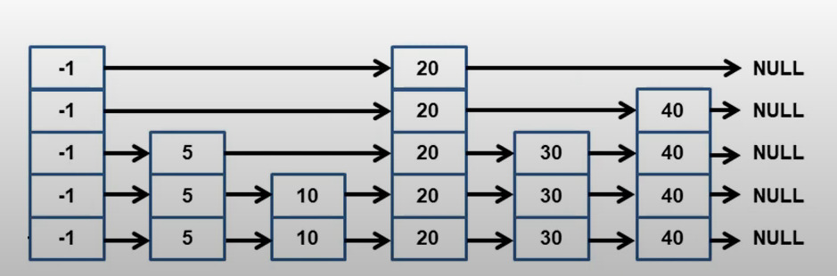
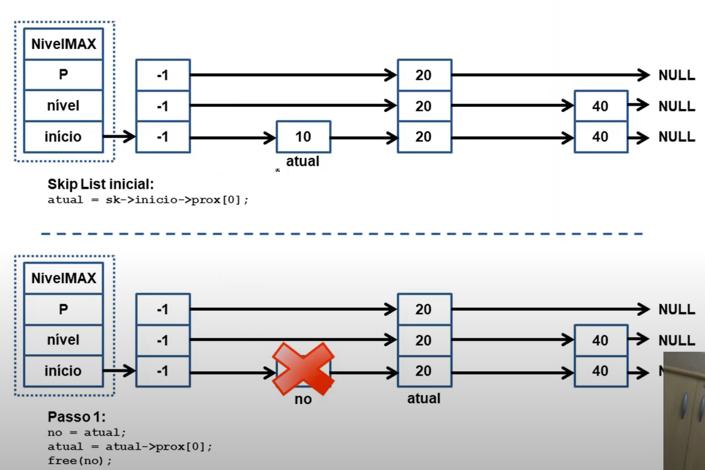
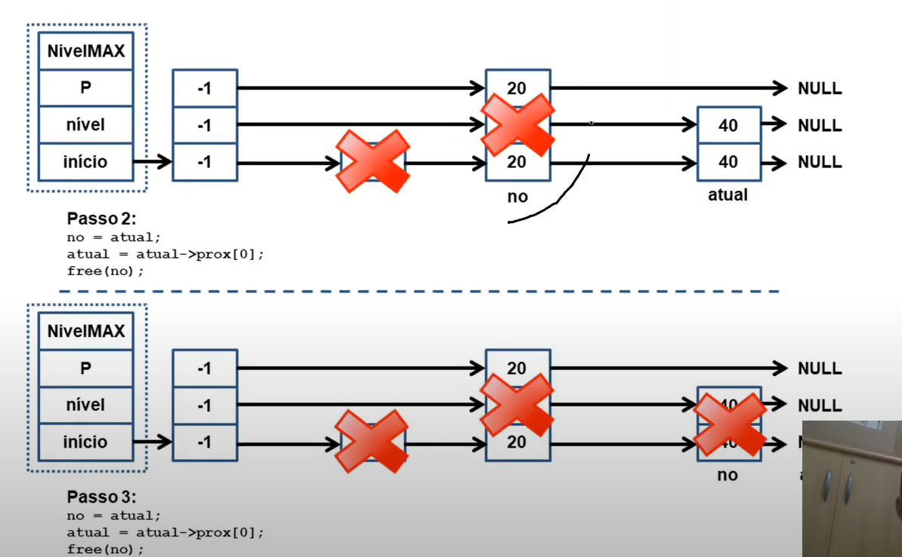
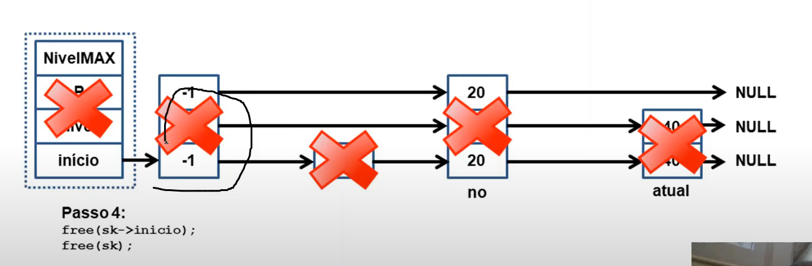

- Generalizacao da Lista Dinamica Encadeada.
- Insercao/Remocao/Busca e feita em `O(log N)`.
- Seu pior caso(raro) e `O(n)`.
- Facil implementacao.

- Usa uma estrutura hierarquica de Listas Dinamicas
- As listas sao organizadas em diferentes niveis
- Niveis mais altos permitem **pular** varios Nos, o que acelera o processo de busca.
- Estrutura aleatoria: usa sorteio para definir o numero de niveis de um No.
- Skip List pode substituir uma arvore:
	- Implementacao mais simples;
	- Insercao/remocao nao exige balancear a estrutura;
	- Proximo elemento pode ser recuperado em custo constante;
---
#### Implementacao

- **Skip List**:
	- Sua implementacao utiliza uma estrutura similar a da Lista Dinamica Encadeada;
	- Cada No da lista possui um **array** de niveis;
	- E o **array** que faz as ligacoes entre os diferentes niveis da lista;
- **Desvantagem**:
	- Necessita que se defina previamente o numero maximo de niveis da **SkipList**;
	- Isso limita o numero de niveis que podemos ter;
- Estrutura do No
```
typedef struct NO{
	int chave;
	struct NO **prox;
}No;
```
- Estrutura da SkipList:
```
typedef struct SkipList{
	// Nivel maximo
	int nivelMAX;
	// Fracao dos Nos
	float P;
	//Nivel atual do No
	int nivel;
	// ponteiro para o No cabecalho
	struct No *inicio;
}SkipList;
```


- **Importante**:
	- Por questoes de desempenho, nossa Skip List ira armazenar a chave apenas na Struct No.
	- Essa struct e quem mantem os ponteiros para os Nos seguintes, Nos diferentes niveis.
---
#### Criando e Destruindo uma SkipList

- Criacao da SkipList:
	- Aloca espaco para o cabecalho.
	- Aloca espaco para o primiro No e inicializa todos os niveis com NULL.
	- Primeiro No define o menor valor a ser armazenado(-1).
```
No* novoNO(int chave, int nivel){
	No *novo = malloc(sizeof(No));
	if(novo){
		novo->chave = chave;
		novo->prox = malloc((nivel+1) * sizeof(No));
		int i;
		for(i=0; i < (nivel+1); i++){
			novo->prox[i] = NULL;
		}
	}
	return novo;
}
```
```
SkipList* criaSkipList(int NivelMAX, float P){
	SkipList *sk = (SkipList*) malloc(sizeof(SkipList));
	if(sk != NULL){
		sk->NivelMAX = NivelMAX;
		sk->P = P;
		sk->nivel = 0;
		sk->inicio = novoNo(-1, NivelMAX);
	}

	return sk;
}
```

- Destruicao da SkipList:
	- Envolve percorrer todos os Nos, liberar o array de niveis e o proprio No;
	- Por fim, liberar o cabecalho;
```
void liberaSkipList(SkipList *sk){
	if(sk == NULL){
		return;
	}

	No *no, *atual;
	atual = sk->incio->prox[0];
	while(atual != NULL){
		no = atual;
		atual = atual->prox[0];
		free(no->prox);
		free(no);
	}
	free(sk->inicio);
	free(sk);

}
```



---
#### Busca na SkipList:

- Para pesquisar um valor V em uma SkipList:
	- Partindo do **maior nivel**, va para o proximo No enquanto a chave for maior do que a do proximo No. Caso contrario, desca um nivel e continue a busca.
	- Esse processo continua ate chegar ao nivel **ZERO**.
	- Se existir, a chave procurada deve estar no nivel **ZERO do proximo No**.
```
int buscaSkipList(SkipList *sk, int chave){
	if (sk == NULL) return 0;

	No *atual = sk->inicio;

	int i;
	for(i= sk->nivel; i >= 0; i--){
		while(atual->prox[i] != NULL && atual->prox[i]->chave < chave){
			atual = atual->prox[i];
		}
	}

	atual = atual->prox[0];
	if(atual != NULL && atual->chave == chave){
		return 1;
	} else {
		return 0;
	}

}
```

---
#### Insercao de um valor na SkipList

- Procurar a posicao de insercao em cada nivel da SkipList e armazenar em um array auxiliar;
- Alocar espaco para o novo No e sortear quantos niveis ele tera.
- Se ele tiver mais niveis que a SkipList, atualizar os niveis do array auxiliar.
- Fazer a ligacao entre o auxiliar e o novo no, similar a lista dinamica encadeada.
```
int sorteiaNivel(SkipList *sk){
	float r = (float)rand()/RAND_MAX;
	int nivel = 0;
	while(r<sk->P && nivel < sk->NivelMAX){
		nivel++;
		r = (float)rand()/RAND_MAX;
	}
	return nivel;
}
```
```
int insereSkipList(SkipList *sk, int chave){
	if(sk == NULL) return 0;

	int i;
	No *atual = sk->inicio;

	No **aux;
	aux = malloc((sk->NivelMAX + 1) * sizeof(No*));
	for(i=0; i <= sk->NivelMAX; i++){
		aux[i] = NULL;
	}

	for(i = sk->nivel; i >= 0; i--){
		while(atual->prox[i] != NULL && atual->prox[i]->chave < chave){
			atual = atual->prox[i];
		}
		aux[i] = atual;
	}

	atual = atual->prox[0];

	if(atual == NULL || atual->chave != chave){
		int novo_nivel = sorteiaNivel(sk);

		No *novo = novoNo(chave, novo_nivel);
		if(novo == NULL){
			free(aux);
			return 0;
		}

		if(novo_nivel > sk->nivel){
			for(i = sk->nivel+1; i <= novo_nivel; i++){
				aux[i] = sk->inicio;
			}
			sk->nivel = novo_nivel;
		}

		for(i=0; i<=novo_nivel;i++){
			novo->prox[i] = aux[i]->prox[i];
			aux[i]->prox[i] = novo;
		}
		free(aux);
		return 1;
	}
}
```

---
#### Remocao SkipList: