### 1. Busca em Grafos
- Consiste em explorar um grafo.
- Processo sistematico de como caminhar por seus vertices e arestas.
- Depende do vertice inicial.
- Varios problemas em grafos podem ser resolvidos efetuando uma busca.
- A operacao de busca pode precisar visitar todos os vertices. Para outros problemas, apenas um subconjunto dos vertices precisa ser visitado.
- **Principais tipos de busca em grafos**:
	- Busca em Profundidade (DFS).
	- Busca em Largura (BFS).
	- Busca pelo menor caminho.
#### 1.1 Busca em Profundidade
- Partindo de um vertice inicial, ela explora o maximo possivel cada um dos seus ramos antes de retroceder (**backtracking**).
- Pode ser usado para:
	- Encontrar componentes conectados e fortemente conectados.
	- Ordenacao topologica de um grafo.
	- Resolver quebra-cabecas (Ex: Labirinto)

#### 1.2 Busca em Largura
- Partindo de um vertice inicial, ela explora todos os vertices vizinhos. Em seguida, para cada vertice sozinho, ela repete esse processo, visitando os vertices ainda inexplorados.
- Pode ser usado para:
	- Achar componentes conectados.
	- Achar todos os vertices conectados a apenas 1 componente.
	- Achar o menor caminho entre dois vertices.
	- Testar bipartidacao em grafos.

##### 1.3 Busca pelo menor caminho
- Partindo de um vertice inicial, calcula a menor distancia desse vertice a todos os demais (desde que exista um caminho entre eles).
- Algoritmo de Dijkstra:
	- Resolve esse problema para grafos *dirigidos* ou *nao dirigidos* com arestas de peso *nao negativo*.
---
### 2. DFS - Busca em Profundidade

- **Regra 1**: Visite um No adjacente nao visitado, marqui-o e coloque-o na pilhas
- **Regra 2**: Se nao puder seguir a regra 1 retire um No da pilha.
- **Regra 3**: Se nao puder seguir a regra 1 e 2, terminou.

- Exemplo Passo a Passo:
- **OBS: Desconsidere a parte do grado de Urziceni para frente.**
- Passo 1: Marca como visitado a cidade Arad e coloca ela no topo da pilha.

- Passo 2: Escolha uma cidade adjacente a Arad, marque-a como visitada e adicione no topo da pilha:
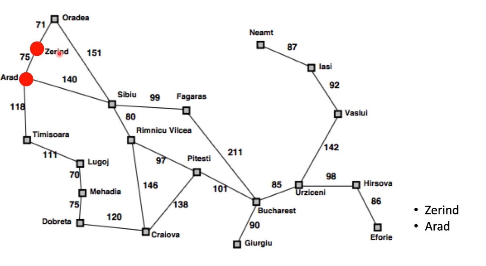
- Passo 3: Escolha uma cidade adjacente a Zerind, como Arad ja foi visitado va para Oradea, marque-a como visitada e adicione no topo da pilha:
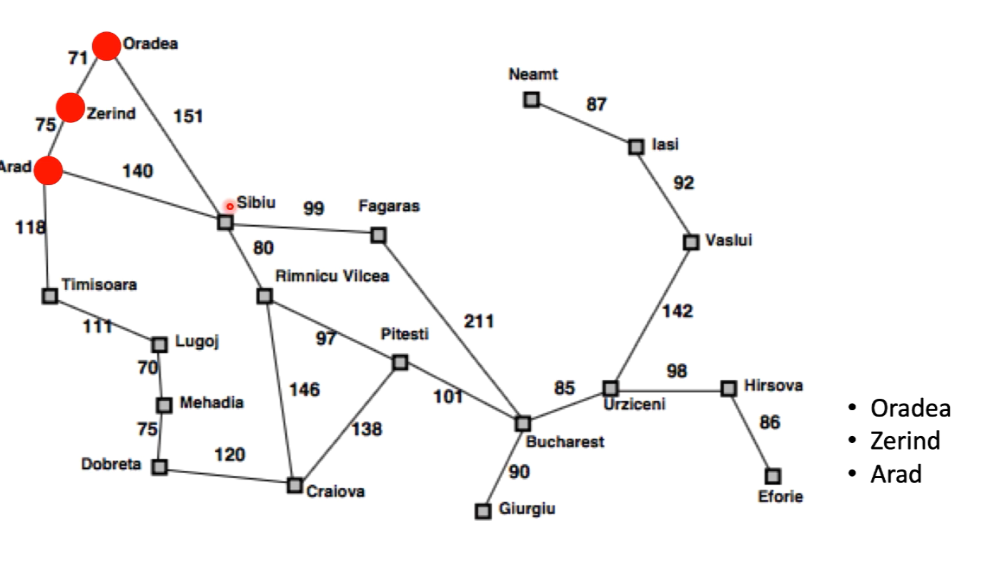
- Passo 4: Escolha uma cidade adjacente a Oradea, como Zerind ja foi visitada va para Sibiu, marque-a como visitada e coloque no topo da pilha.
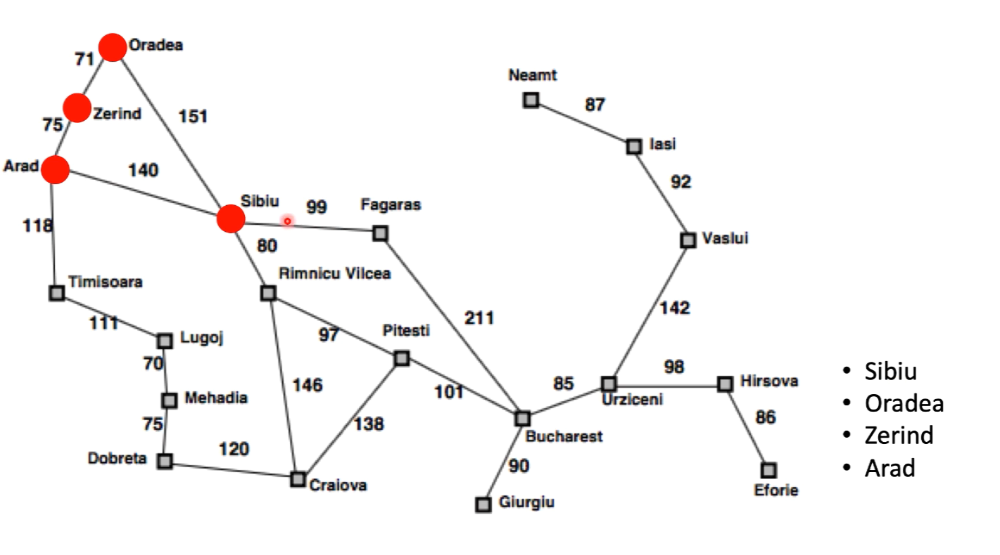
- Passo 5: Escolha uma cidade adjacente a Sibiu, nesse caso Fagara, marque-a como visitada e coloque no topo da pilha:
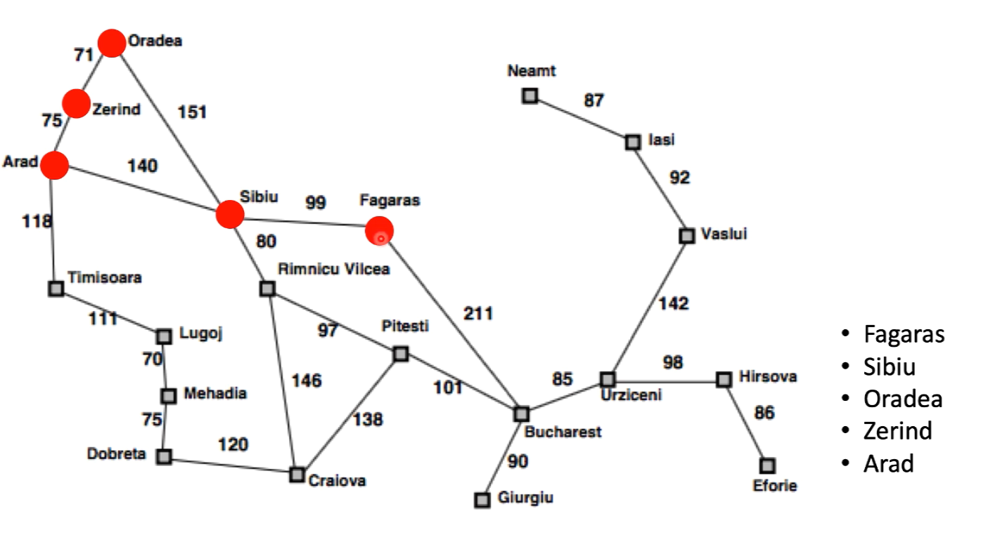
- Passo 6: Escolha uma cidade adjacente de Fagara, nesse caso Bucharest, marque-a e coloque no topo da pilha:

- Passo 7: Escolha uma cidade adjacente a bucharest, nesse caso Pitesti, marque-a como visitada e coloque no topo da pilha:
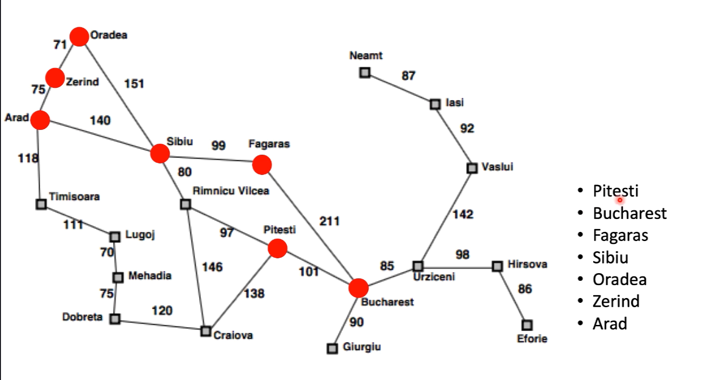
- Passo 8: Escolha uma cidade adjacente a Pitesti, nesse caso Rimnicu, marque-a como visitada e coloque no topo da pilha:
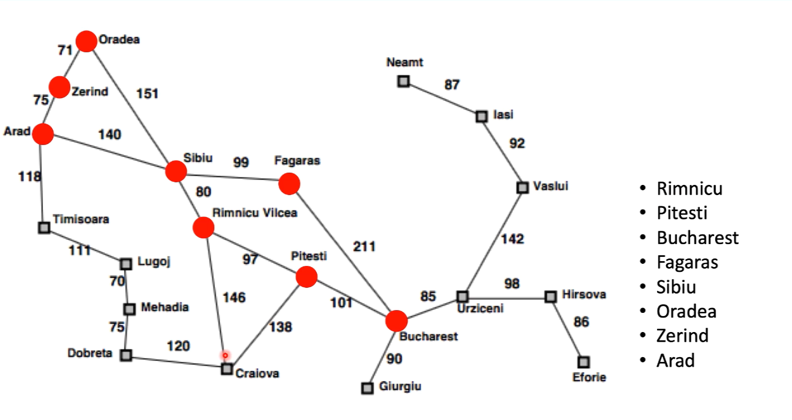
- Passo 9: Escolha uma cidade adjacente a Rimnicu, nesse caso Craiova, marque-a como visitada e coloque no topo da pilha:
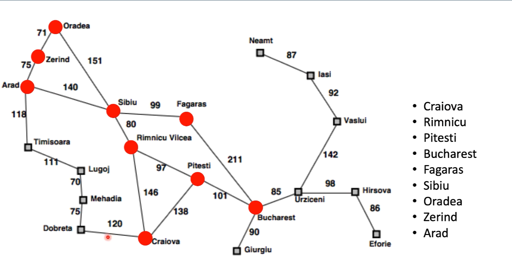
- Passo 10: Escolha uma cidade adjacente a Craiova, nesse caso Dobreta, marque-a como visitada e coloque no topo da pilha:
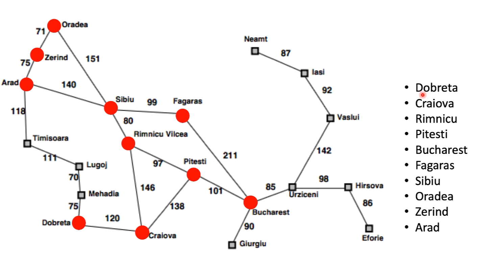
- Passo 11: Escolha uma cidade adjacente a Dobreta, nesse caso Mehadia,marque-a como visitada e coloque no topo da pilha:
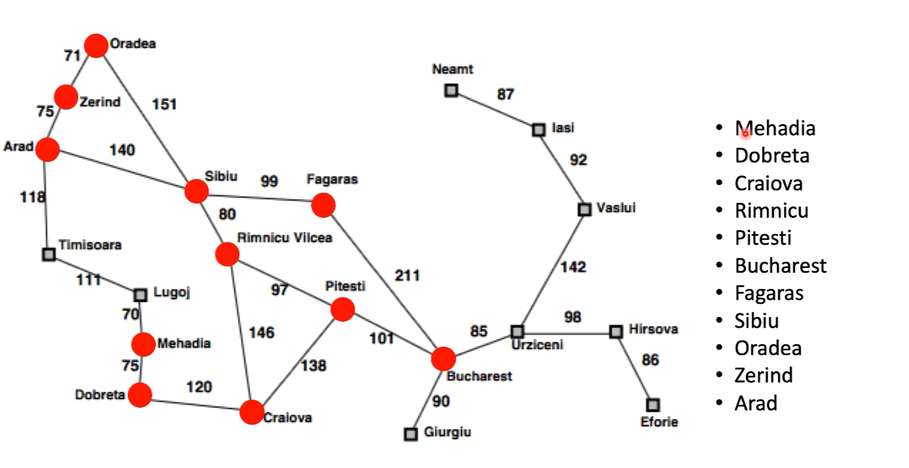
- Passo 11: Escolha uma cidade adjacente a Mehadia, nesse caso Lugoj ,marque-a como visitada e coloque no topo da pilha:
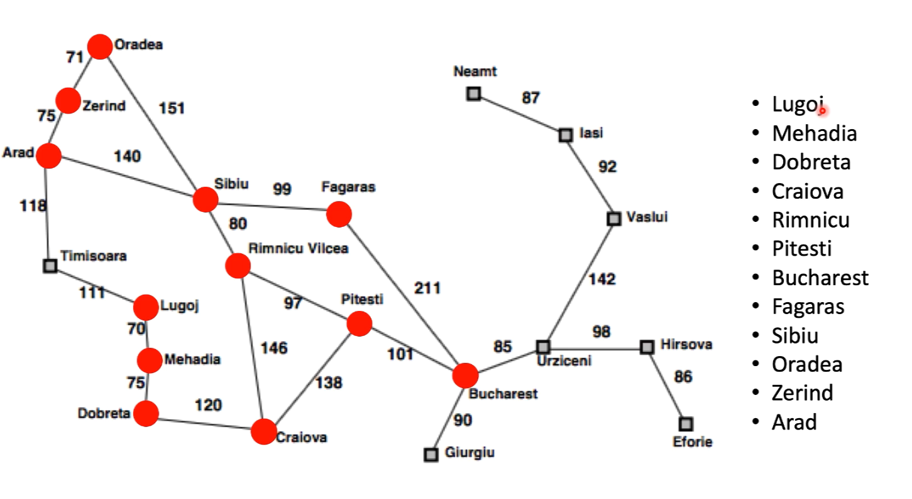
- Passo 12: Escolha uma cidade adjacente a Lugoj, nesse caso Timisoara, marque-a como visitada e coloque no topo da pilha:
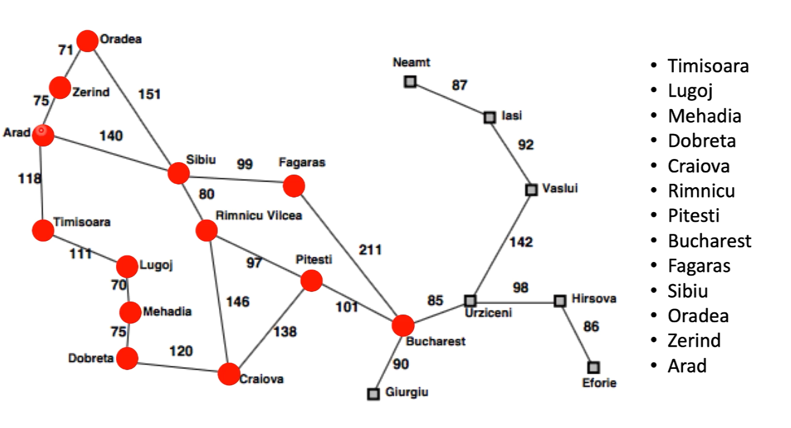
- Passo 13: Como Timisoara nao tem cidades adjacentes nao visitadas, desempilha da lista.
- Passo 14: Como Lugoj nao tem cidades adjacentes nao visitadas, desempilha da lista.
- Passo 15: Como Mehadia nao tem cidades adjacentes nao visitadas, desempilha da lista.
- Passo 16: Como Dobreta nao tem cidades adjacentes nao visitadas, desempilha da lista.
- Passo 17: Como Craiova nao tem cidades adjacentes nao visitadas, desempilha da lista.
- Passo 18: Como Rimnicu nao tem cidades adjacentes nao visitadas, desempilha da lista.
- Passo 19: Como Pitesti nao tem cidades adjacentes nao visitadas, desempilha da lista.
- Passo 20: Como Bucharest tem Giurgiu como adjacente, marque-a coloque na pilha:
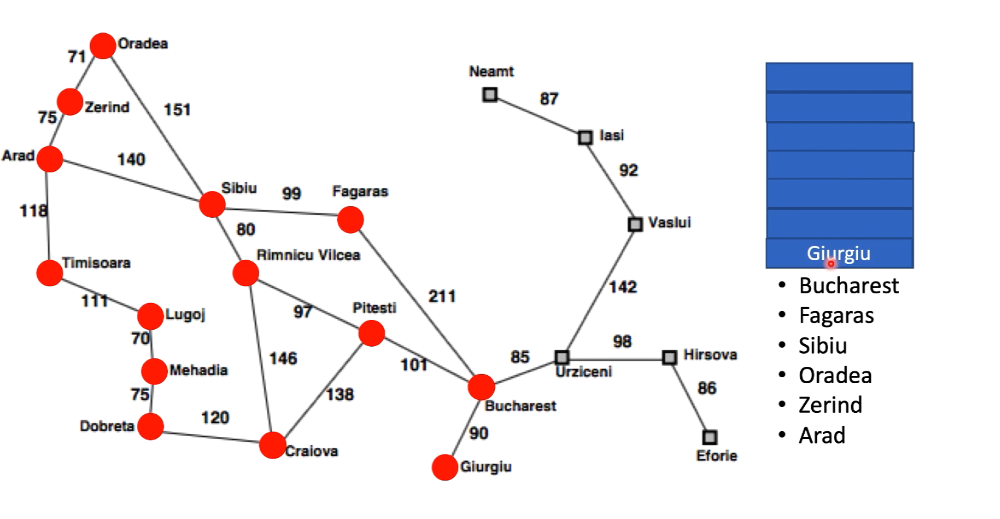

- Passo 21: Como Giurgiu nao tem cidades adjacentes nao visitadas, desempilha da lista.
- Passo 22: Como Bucharest nao tem cidades adjacentes nao visitadas, desempilha da lista.
- Passo 23: Como Fagaras nao tem cidades adjacentes nao visitadas, desempilha da lista.
- Passo 24: Como Sibiu nao tem cidades adjacentes nao visitadas, desempilha da lista.
- Passo 25: Como Oradea nao tem cidades adjacentes nao visitadas, desempilha da lista.
- Passo 26: Como Zerind nao tem cidades adjacentes nao visitadas, desempilha da lista.
- Passo 27: Como Arad nao tem cidades adjacentes nao visitadas, desempilha da lista.
- Por fim, percorreu todos os vertices do Grafo

- Funcao para realizar busca em Profunidade com **Pilha** em um grafo com lista de adjacencia
```
// Função para realizar busca em profundidade (DFS - Depth-First Search) usando pilha
void DFS(Grafo* grafo, int verticeInicial) {
    // Verificar se o grafo existe e tem vértices
    if (!grafo || grafo->numVertices <= 0) return;
    
    // Estrutura de pilha simples
    int* pilha = (int*)malloc(grafo->numVertices * sizeof(int));
    int topo = -1;
    
    // Inicializar array de visitados
    for (int i = 0; i < grafo->numVertices; i++) {
        grafo->visitado[i] = 0;
    }
    
    // Empilhar o vértice inicial
    pilha[++topo] = verticeInicial;
    
    while (topo >= 0) {
        // Desempilhar o vértice do topo
        int vertice = pilha[topo--];
        
        // Se o vértice não foi visitado, processá-lo
        if (!grafo->visitado[vertice]) {
            // Marcar como visitado e imprimir
            grafo->visitado[vertice] = 1;
            printf("%d ", vertice);
            
            // Empilhar todos os vizinhos não visitados na ordem inversa
            // (para garantir que a ordem de processamento seja semelhante à recursiva)
            
            // Primeiro, contar quantos vizinhos não visitados existem
            int count = 0;
            No* temp = grafo->listaAdj[vertice].cabeca;
            while (temp) {
                if (!grafo->visitado[temp->vertice]) {
                    count++;
                }
                temp = temp->proximo;
            }
            
            // Criar um array temporário para os vizinhos
            int* vizinhos = (int*)malloc(count * sizeof(int));
            int idx = 0;
            
            // Preencher o array com vizinhos não visitados
            temp = grafo->listaAdj[vertice].cabeca;
            while (temp) {
                if (!grafo->visitado[temp->vertice]) {
                    vizinhos[idx++] = temp->vertice;
                }
                temp = temp->proximo;
            }
            
            // Empilhar na ordem inversa (para manter a mesma ordem da recursão)
            for (int i = idx - 1; i >= 0; i--) {
                pilha[++topo] = vizinhos[i];
            }
            
            free(vizinhos);
        }
    }
    
    free(pilha);
}
```

- Funcao para realizar busca em Profundidade com **Recursao** em um grafo com lista de adjacencia
```
void DFS(Grafo* grafo, int vertice) {

    // Marcar o vértice atual como visitado
    grafo->visitado[vertice] = 1;
    printf("%d ", vertice);

    // Percorrer os vértices adjacentes ao vértice atual
    No* temp = grafo->listaAdj[vertice].cabeca;
    
    while (temp) {
        int verticeAdjacente = temp->vertice;

        // Se o vértice adjacente ainda não foi visitado, chama DFS para ele
        if (!grafo->visitado[verticeAdjacente]) {
            DFS(grafo, verticeAdjacente);
        }
        temp = temp->proximo;
    }
}
```

- Funcao para realizar busca em Profundidade em um grafo com matriz de adjacencia:
```
void DFS(Grafo* grafo, int vertice) {

    // Marcar o vértice atual como visitado
    grafo->visitado[vertice] = 1;
    printf("%d ", vertice);

    // Percorrer todos os vértices adjacentes ao vértice atual
    for (int i = 0; i < grafo->numVertices; i++) {

        // Se existe uma aresta e o vértice ainda não foi visitado
        if (grafo->matriz[vertice][i] && !grafo->visitado[i]) {
            DFS(grafo, i);
        }
    }
}
```

--- 
### 3. BFS - Busca em Largura
- Partindo de um vertice inicial, ela explora todos os vertices vizinhos. Em seguida, para cada vertice vizinho, ela repete esse processo, visitando os vertices ainda inexplorados.
- **Regra 1**: Visite um No adjacente nao visitado, marque-o e coloque-o na fila.
- **Regra 2**: Se nao puder seguir a Regra 1 remova um no da gila e torno-o o No atual.
- **Regra 3**: Se nao puder executar a Regra 2 porque a fila esta vazia, terminou.

- Exemplo:
- **OBS: Desconsidere a parte do grado de Urziceni para frente.**
- Passo 1: Marque o No inicial como visitado e coloque na fila:
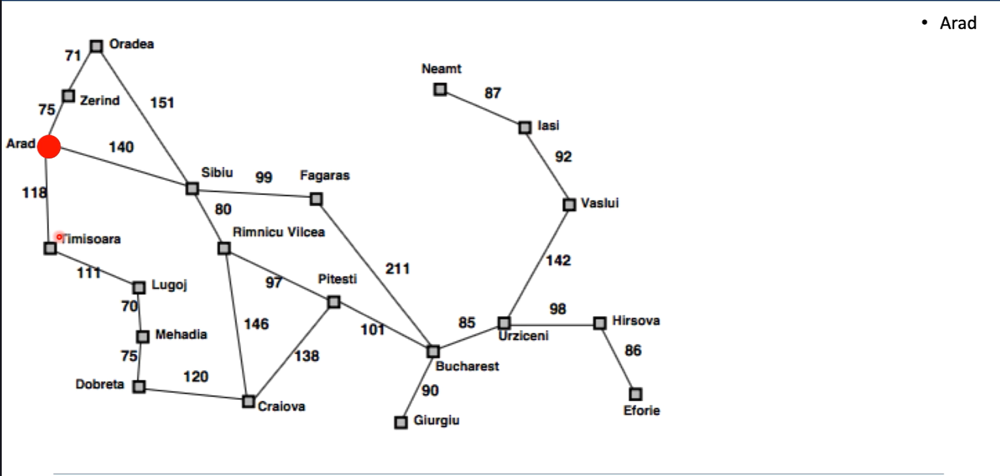
- Passo 2: Coloque todas as cidades adjacentes a Arad no final da fila e remova Arad da Fila:
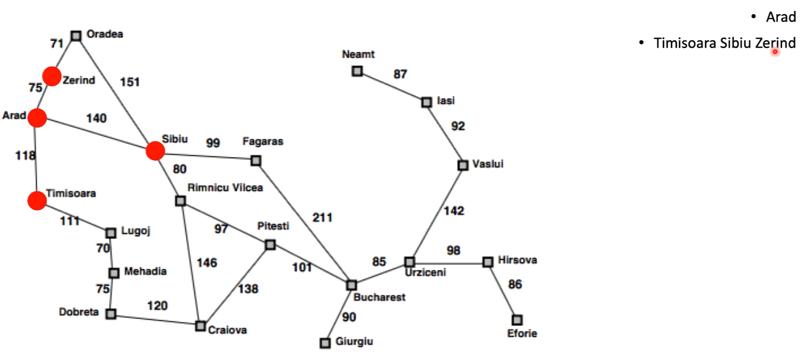
- Passo 3: Como Zerind e o primeiro da Fila, pegue os adjacentes dele e coloque no final da Fila e depois retire Zerind:
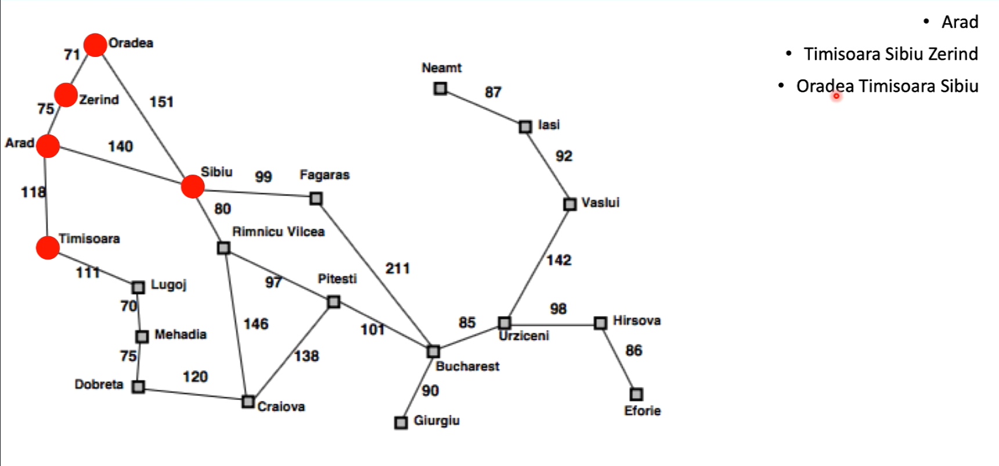
- Passo 4: Va para o primeiro da Fila, nessa caso Sibiu, pegue as cidades adjacentes e coloque no final da fila tirando Sibiu da fila:
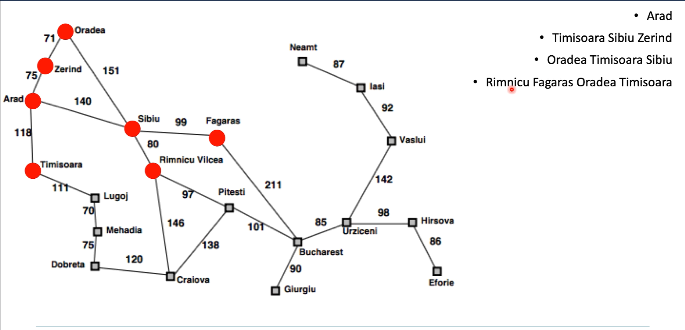
- Passo 5: Va para o primeiro da fila, nessa caso Timisoara, coloque as cidades adjacentes no final da fila e tire Timisoara:
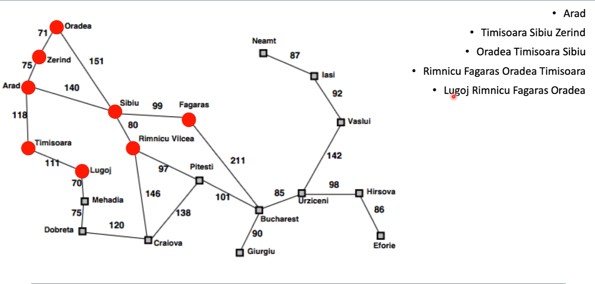
- Passo 6: Va para o primeiro da fila, nessa caso Oradea, como as cidades adjacentes a essa cidade ja foram visitadas apenas tira ela da Fila:
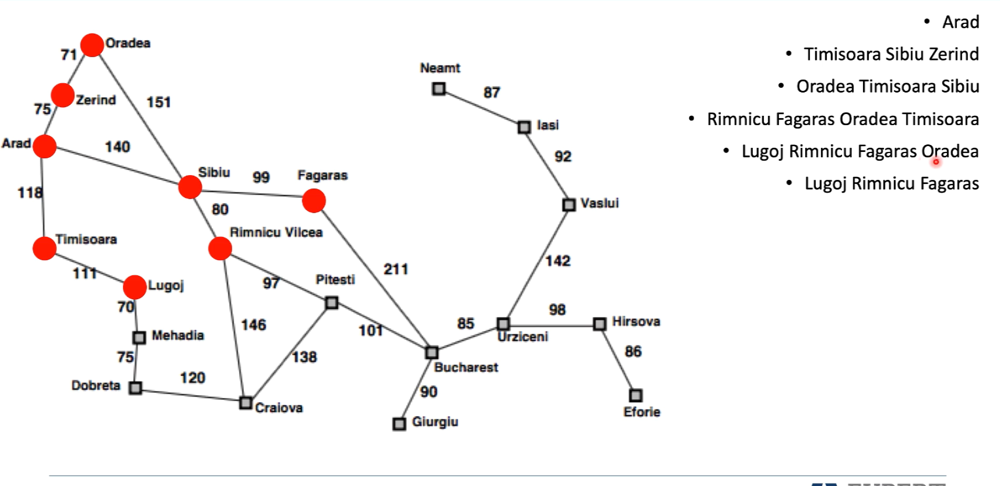
- Passo 7: Va para o primeiro da fila, nessa caso Fagaras, coloque as cidades adjacentes no final da fila e tire Fagaras:
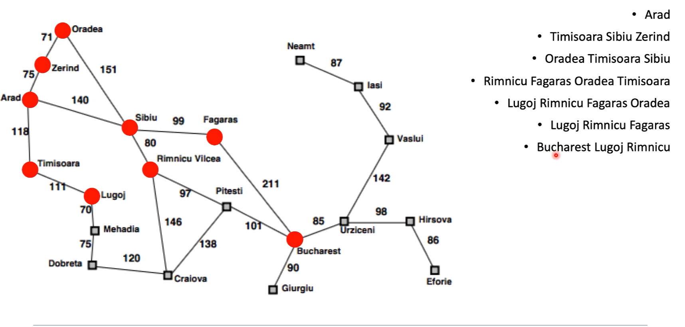
- Passo 8: Va para o primeiro da fila, nessa caso Rimnicu, coloque as cidades adjacentes no final da fila e tire Rimnicu:
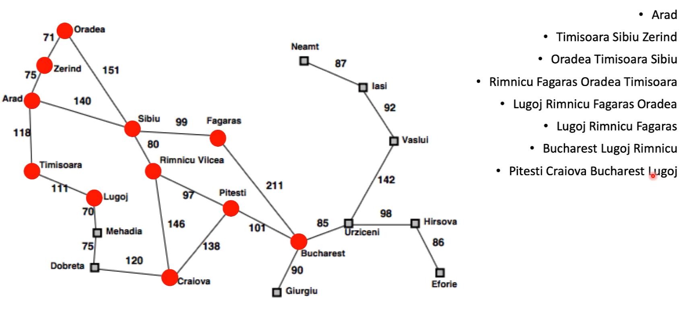
- Passo 9: Va para o primeiro da fila, nessa caso Lugoj, coloque as cidades adjacentes no final da fila e tire Lugoj:
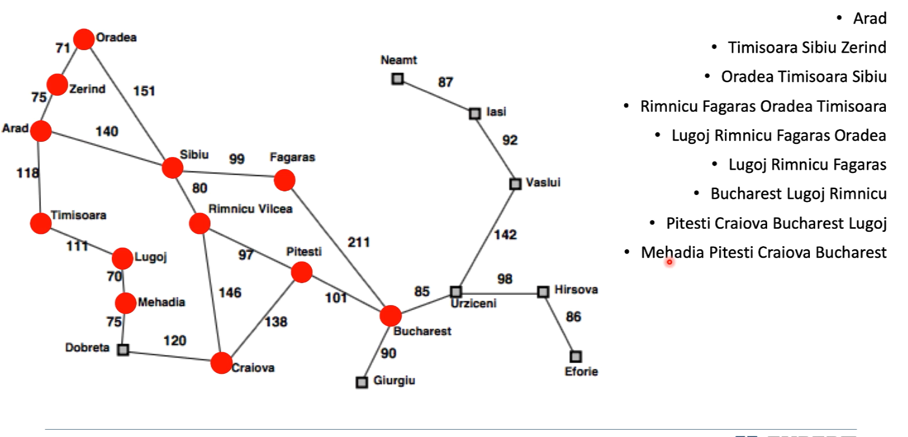
- Passo 10: Va para o primeiro da fila, nessa caso Bucharest, coloque as cidades adjacentes no final da fila e tire Bucharest:
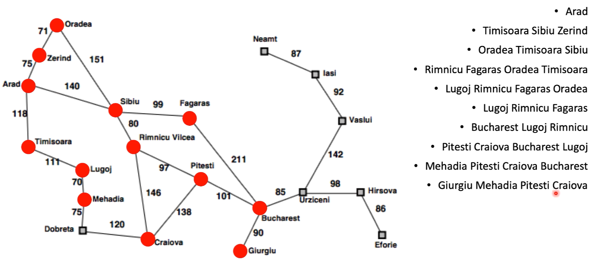
- Passo 11: Va para o primeiro da fila, nessa caso Craiova, coloque as cidades adjacentes no final da fila e tire Craiova:
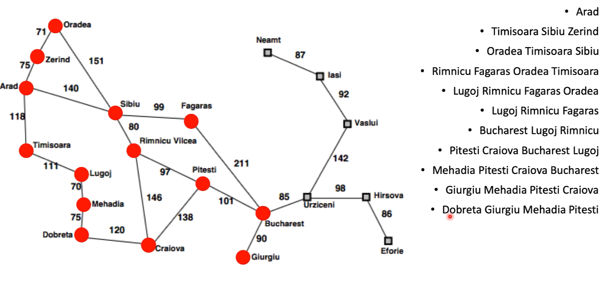
- Passo 12: Como Pitesti nao tem nenhum adjacente nao visitado tire da Fila.
- Passo 13: Como Mehadia nao tem nenhum adjacente nao visitado tire da Fila.
- Passo 14: Como Giurgiu nao tem nenhum adjacente nao visitado tire da Fila.
- Passo 15: Como Dobreta nao tem nenhum adjacente nao visitado tire da Fila.
- Passo 16: Retirando Dobreta a Fila fica vazia, assim acabando a Busca.

- Funcao para realizar busca em Largura em Grafos com lista de adjacencia
```
void BFS(Grafo* grafo, int verticeInicial) {

    // Criar uma fila para BFS
    int fila[1000]; // Tamanho arbitrário
    int frente = 0, fim = 0;

    // Reiniciar o array de visitados
    for (int i = 0; i < grafo->numVertices; i++) {
        grafo->visitado[i] = 0;
    }

    // Marcar o vértice atual como visitado e enfileirá-lo
    grafo->visitado[verticeInicial] = 1;
    fila[fim++] = verticeInicial;

    // Loop para BFS
    while (frente != fim) {

        // Desenfileirar um vértice e imprimi-lo
        int verticeAtual = fila[frente++];
        printf("%d ", verticeAtual);

        // Obter todos os vértices adjacentes do vértice desenfileirado
        No* temp = grafo->listaAdj[verticeAtual].cabeca;

        while (temp) {
            int adjacente = temp->vertice;

            // Se o adjacente não foi visitado, marcá-lo e enfileirá-lo
            if (!grafo->visitado[adjacente]) {
                grafo->visitado[adjacente] = 1;
                fila[fim++] = adjacente;
            }
            temp = temp->proximo;
        }
    }
}
```

- Funcao para realizar Busca em largura em grafos com Matriz de adjacencia
```
void BFS(Grafo* grafo, int verticeInicial) {

    // Criar uma fila para BFS
    int fila[1000]; // Tamanho arbitrário
    int frente = 0, fim = 0;

    // Reiniciar o array de visitados
    for (int i = 0; i < grafo->numVertices; i++) {
        grafo->visitado[i] = 0;

    }

    // Marcar o vértice inicial como visitado e enfileirá-lo
    grafo->visitado[verticeInicial] = 1;
    fila[fim++] = verticeInicial;

    // Loop para BFS
    while (frente != fim) {

        // Desenfileirar um vértice e imprimi-lo
        int verticeAtual = fila[frente++];
        printf("%d ", verticeAtual);

        // Percorrer todos os vértices adjacentes ao vértice atual
        for (int i = 0; i < grafo->numVertices; i++) {
            // Se existe uma aresta e o vértice ainda não foi visitado
            if (grafo->matriz[verticeAtual][i] && !grafo->visitado[i]) {
                grafo->visitado[i] = 1;
                fila[fim++] = i;
            }
        }
    }
}
```

- ---
### 4. Comparacao

| **Aspecto**                | **BFS**                                       | **DFS**                                                        |
| -------------------------- | --------------------------------------------- | -------------------------------------------------------------- |
| **Estrutura da Fronteira** | Fila                                          | Pilha/Recursao                                                 |
| **Ordem de exploracao**    | Por Distancia(Nivel-a-Nivel)                  | Vai "ai fundo" antes de voltar                                 |
| **Distancia minima**       | Sim (em numero de arestas)                    | Nao                                                            |
| **Deteccao de Ciclos**     | Requer marcaacoes extras                      | Natural                                                        |
| **Aplicacoes Tipicas**     | Caminho minimo sem peso, calculo de distancia | Componentes, ciclos, ordenacao topologica, pontes/articulacoes |
| **Uso de Memoria**         | O(V) + Fila(Pico <= V)                        | O(V) + Pilha (pico <=V)                                        |
| **Pior Caso Pratico**      | Grafos "largos" com muitos niveis             | Grafos "profundos" com cadeias longas                          |
- Generalizacoes e Extensoes:
	- **Busca com pesos não negativos** → Dijkstra (prioridade na fronteira).
    
	- **Busca em grafos infinitos ou espaços de estado** → A* (uso de heurística).
    
	- **Busca bidirecional** → aplica BFS simultâneo de origem e destino para encontrar encontro mais rapidamente.
    
	- **Busca em árvores de decisão** → backtracking (variação de DFS) com poda baseada em restrições.