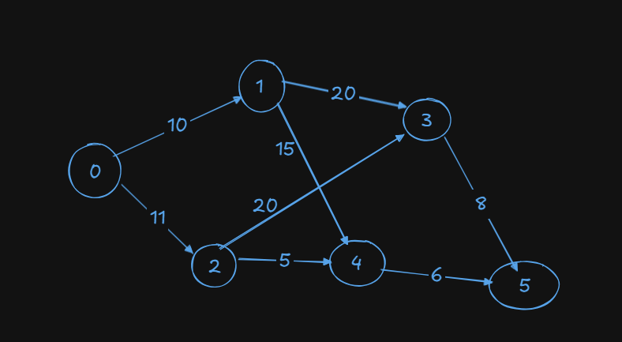
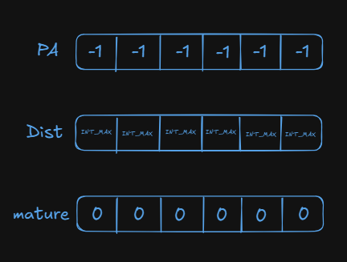
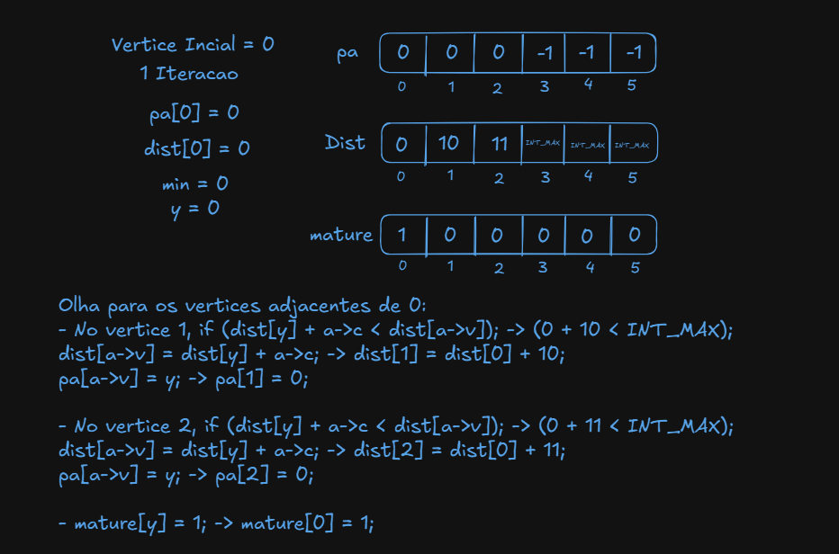
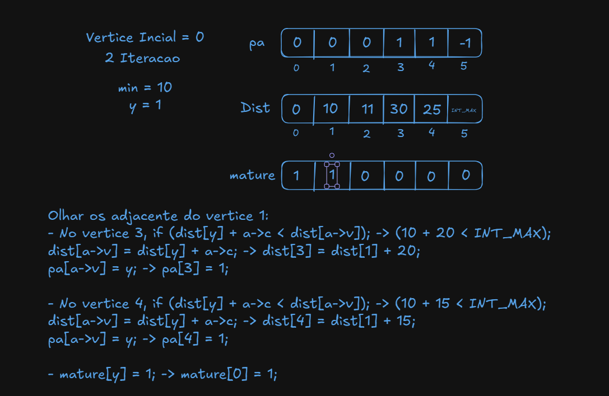
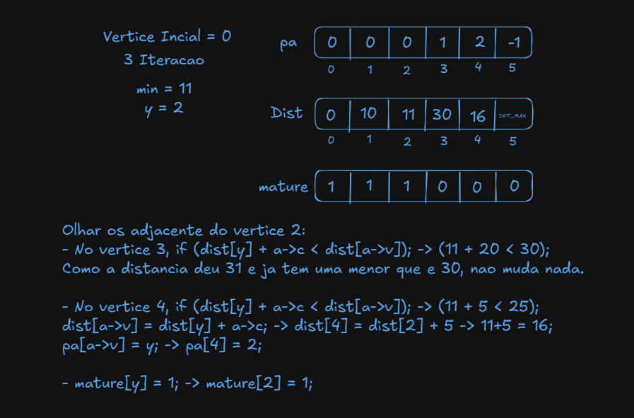
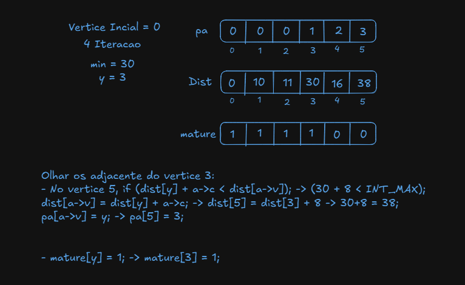
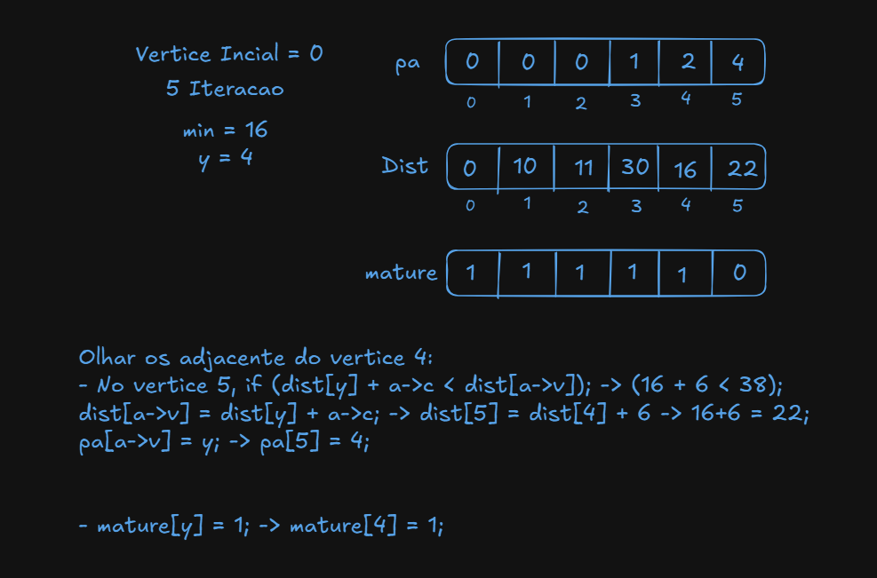
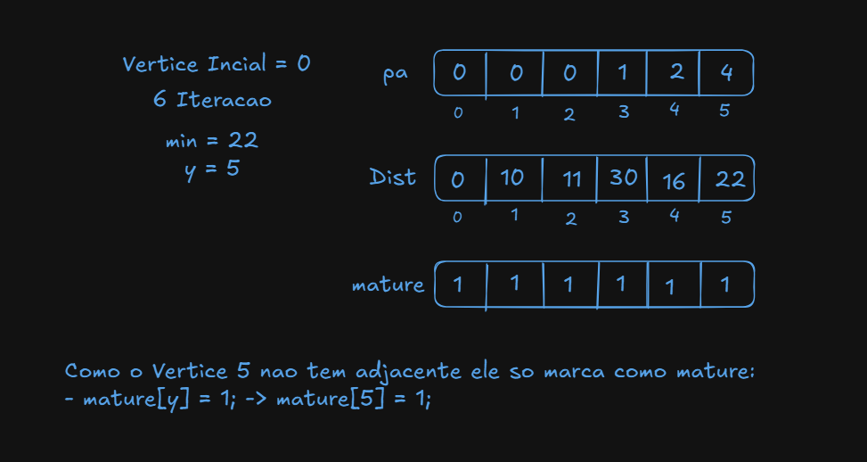

- Edsger Dijstra, 1959
- Encontra o caminho mais curto a partir de um no especificado ate todos os outros.
- Descobrir a maneira mais barata de viajar de A ate todas as outras cidades.
- Somente Pesos positivos.
## Dijkstra Ingenuo

- Mais ineficiente, embora seja suficientemente eficiente em grafos densos.
- Em grafos nao densos nao e muito bom.
### 1. Implementacao:
#### 1.1 Funcao
```
void GRAPHcptD1(Graph G, int s, int *pa, int *dist){
```
- `Graph G`: ponteiro para a estrutura do grafo, que deve conter ao menos `G->V` (número de vértices) e `G->adj` (lista de adjacências).
- `int s`: índice do vértice de origem (source) de onde as distâncias serão calculadas.
- `int *pa`: vetor de predecessores (parent array), de tamanho `G->V`. Para cada vértice `v`, `pa[v]` armazenará o vértice anterior no caminho mínimo de `s` até `v`.
- `int *dist`: vetor de distâncias mínimas de `s` até cada vértice, também de tamanho `G->V`.

#### 1.2 Inicializacao:
```
bool mature[1000];
for(int v = 0; v < G->V; v++){
    pa[v] = -1;
    mature[v] = false;
    dist[v] = INT_MAX;
}

pa[s] = s;
dist[s] = 0;
```
- 1. **`bool mature[1000]:`**
	- Array auxiliar que marca quais vértices já tiveram suas distâncias finais — ou seja, já foram “processados” (no sentido de Dijkstra).
- 2. **Loop de inicialização (`for v`):**
	- `pa[v] = -1;` — não há predecessor definido ainda para nenhum vértice.
	- `mature[v] = false;` — nenhum vértice está maduro/finalizado no início.
	- `dist[v] = INT_MAX;` — inicializa todas as distâncias como “infinito” (ex.: `2^31–1`), indicando que ainda não conhecemos caminho algum até esses vértices.
- 3. **Configuração do vértice-fonte (`s`):**
	- `pa[s] = s;` — por convenção, o predecessor de `s` é ele mesmo.
	- `dist[s] = 0;` — distância de `s` até `s` é zero.
#### 1.3 Loop Principal:
```
while(true){
    int min = INT_MAX;
    int y;
```
- Este `while` roda até que todos os vértices alcançáveis tenham sido “madurados” (ou até não restarem vértices com distância finita não processados).
- `min` guardará a menor distância encontrada no laço de seleção de vértice.
- `y` será o índice desse vértice “mais próximo” (com menor `dist`).

#### 1.4 Seleção do Próximo Vértice a Processar:
```
    for(int z = 0; z < G->V; v++){
        if(mature[z]) continue;
        if(dist[z] < min){
            min = dist[z];
            y = z;
        }
    }

    if(min == INT_MAX){
        break;
    }

```
- **1. Loop `for z`:**
	- Percorre todos os vértices `z`.
	- Se `mature[z]` for `true`, esse vértice já teve sua distância definitiva e é ignorado.
	- Compara `dist[z]` com o `min` atual; se for menor, atualiza `min` e define `y = z`.
- **2. Condição de término:**
	- Se `min` permanecer como `INT_MAX`, significa que não há mais nenhum vértice alcançável (ou todos estão maduros). Então sai do `while`.

#### 1.5 Relaxamento das Arestas de `y`:
```
    for(link a = G->adj[y]; a != NULL; a = a->next){
        if(mature[a->v]) continue;
        if(dist[y] + a->c < dist[a->v]){
            dist[a->v] = dist[y] + a->c;
            pa[a->v] = y;
        }
    }

```
- `G->adj[y]` é a cabeça da lista de todas as arestas que saem de `y`.
- Para cada aresta `a`:
	- 1. **Ignorar vértices já maduros** (`if(mature[a->v]) continue;`): não faz sentido tentar relaxar para um vértice já finalizado.
	- 2. **Checar possibilidade de caminho menor**:
		- `dist[y] + a->c` é a distância até `y` mais o custo `c` da aresta `(y → a->v)`.
		- Se esse valor for menor que o `dist[a->v]` atual, encontramos um caminho mais curto para `a->v`.
		- Atualiza `dist[a->v]` e registra `y` como predecessor de `a->v` em `pa[a->v] = y`.

#### 1.6 Marcar `y` como “Maduro” e Repetir:
```
    mature[y] = true;
}

```
- Após relaxar todas as arestas de saída de `y`, definimos `mature[y] = true`, sinalizando que a distância de `s` até `y` é definitiva.
- Volta ao início do `while` para escolher o próximo vértice com menor distância dentre os não maduros.
#### 1.7 Algoritmo Completo:

```
void GRAPHcptD1(Graph G, int s, int *pa, int *dist){

	bool mature[1000];
	for(int v = 0; v < G->V; v++){
		pa[v] = -1;
		mature[v] = false;
		dist[v] = INT_MAX;
	}

	pa[s] = s;
	dist[s] = 0;

	
	while(true){
		int min = INT_MAX;
	
		int y;

		for(int z = 0; z < G->V; v++){
			if(mature[z]){
				continue;
			}

			if(dist[z] < min){
				min = dist[z];
				y = z;
			}		
		}

		if(min == INT_MAX){
			break;
		}

		for(link a = G->adj[y]; a != NULL; a = a->next){
			if(mature[a->v]){
				continue;
			}
			if(dist[y] + a->c < dist[a->v]){
				dist[a->v] = dist[y] + a->c;
				pa[a->v] = y;
			}
			
		}
		mature[y] = true;
	}
}
```

### 2. Complexidade e Observações

- **Complexidade**: Este código, na forma apresentada, usa busca linear para encontrar o vértice de menor distância em cada iteração, resultando em O(V2+E)O(V^2 + E)O(V2+E), que é aceitável para grafos densos, mas pode ser lento para VVV muito grande.
- **Otimização com heap**: Em implementações com fila de prioridade (min-heap ou Fibonacci heap), essa seleção de mínimo e atualização fica em O((V+E)log⁡V)O((V+E)\log V)O((V+E)logV), mais eficiente para grafos esparsos.
- **Limite fixo em `mature[1000]`**: esse array suporta até 1000 vértices; para grafos maiores, seria melhor usar alocação dinâmica.

### 3. Execucao Manual


- Os Vetores Iniciam assim:

- Iteracao 1:


- Iteracao 2:


- Iteracao 3:


- Iteracao 4:


- Iteracao 5:


- Iteracao 6 (FINAL):



