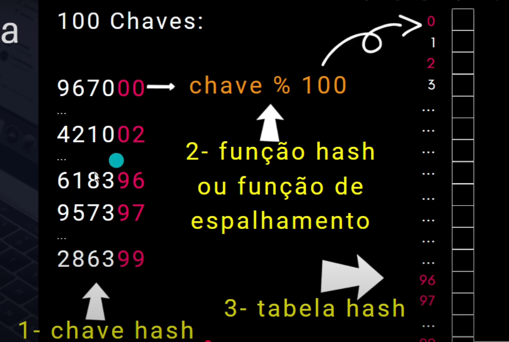
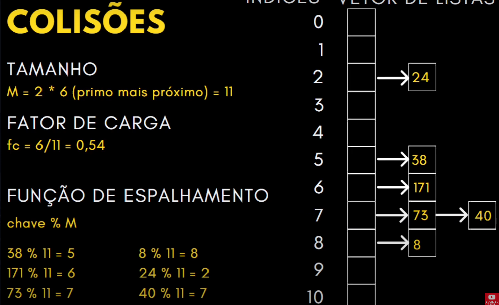

### 1. Oque e uma Tabela Hash
- Estrutura de dados utilizada para tornar o processo de busca mais eficiente;
- E basicamente um vetor em que os indices sao hashs de um elemento
- Parecido com dicionario do python;
- Cada elemento da tabela possui uma chave unica, e essa chave e o indice do vetor que o elemento se encontra;
- Usa os ultimos dois digitos das chaves para verificar o indice no vetor, isso faz com que evite desperdicio de memoria;
	- `chave % 100` Funcao hash ou funcao de espalhamento;
- As chaves hash sao unicas;
- 

---
### 2. Funcao Hash
- Pega o elemento que quer inserir e pega o resto da divisao com alguma numero;
- O resto sera a chave Hash, ou seja, o indice que o elemento vai ser inserido no vetor
- `Chave % <tam_tabelaHash>`
- 

---
### 3. Tratamento de colisoes

- Para evitar colisoes crie um tabela hash com tamanho primo
- Para descobrir esse primo, olhe para a quantidade de dados que tem que inserir e multiplique por 2, e depois pegue o numero primo mais proximo do resultado;
- EX: `M = 2 * <num_elemento> = (Primo mais proximo)`
- Fator de  carga: divida o numero de elementos pelo tamanho da tabela, para descobrir a porcentagem da tabela que sera ocupada;
- O fator de carga vai de 0 a 1, se for muito perto de 0 a tabela nao esta sendo usada corretamente havendo despedicio de memoria, se for muito perto de 1 a tabela estara muito cheia prejudicando na busca de um elemento;
- Quando houver colisao, cheque o numero do hash + 1, ou seja, procure a proxima posicao vaga;
---
### 4. Tabela Hash com Lista encadeada
- Cada posicao do vetor e composta por uma lista encadeada
- Ao inserir o indice do vetor apontara para um lista encadeada com o valor inserido
- se houver colisao, coloca o numero como o proximo da lista encadeada;
- 

---
### 5. Conceitos essenciais
- `TAMANHO`: Quantidade maxima de elementos na tabela
- `FUNCAO HASH`: Funcao que gera um codigo a ser utilizado como indice de acesso na tabela;
- `COLISOES`: Ocorre uma colisao quando a funcao de hash gera o mesmo codigo para chaves diferentes;
- `FATOR DE CARGA`: Quantidade de elementos dividido pelo Tamanho da Tabela;
---
### 6. Implementacao da Tabela Hash linear
```
#include <stdio.h>
#include <stdlib.h>
#define TAM  31 # Tamanho da tabela Hash

# Inicializa o vetor com todas os valores 0;
void inicializarTabela(int t[]){
		for(int i = 0; i < TAM; i++)
		t[i] = 0;
}

# Funcao para descobrir o indice que vai ser inserido
int hash(int chave){ 
	return chave % TAM
}

# Funcao para inserir um valor na tabela
void inserir(int t[], int valor){
	int id = hash(valor);
	while(t[id] != 0){
		id = hash(id + 1);
	}
	t[id] = valor;
}

#Funcao que busca um valor na tabela
int busca(int t[], int chave){
	int id = hash(chave);
	while(t[id] != 0){
		if(t[id] == chave){
			return t[id];
		} else {
			id = hash(id+1);
		}
	return 0;
}

#Funcao para imprimir a tabela
void imprimir(int t[]){
	for(int i = 0; i < TAM; i++){
		printf("%d = %d\n", i, t[i]);
	}

}


}
int main(){

	int opcao, tabela[TAM]; # Vetor da tabela hash
	return 0;

}
```
---
### Tabela Hash com Lista Encadeada:

- Cada indice do vetor sera composto por uma lista encadeada;
- Evita colisoes, pois mesmo se houver colisoes o elemento ficara no msm indice, ou seja, ficara na lista encadeada presente no indice do Hash;
- `Implementacao:`
```
#include <stdio.h>
#include <stdlib.h>
#define TAM  31 # Tamanho da tabela Hash

# Struct do No da lista encadeada
typedef struct no{
	int chave;
	struct no *proximo;
}No;

# Estrutura da lista encadeada
typedef struct{
	No *inicio;
	int tam;
}Lista;

# Inicializa a Lista encadeada vazia
void inicializar_Lista(Lista *l){
	l->inicio = NULL;
	l->tam = 0;
}

# Funcao para inserir itens na lista;
void inserir_Lista(Lista *l, int valor){
	No *novo = malloc(sizeof(No));
	
	if(novo){
		novo->chave = valor;
		novo->proximo = l->inicio;
		l->inicio = novo;
	} else {
		printf("Erro")
	}
}

#Buscar um elemento na lista encadeada
int buscar_Lista(Lista *l, int valor){
	No *aux = l->inicio;
	while(aux && aux->chave != valor){
		aux = aux->proximo;
	}

	if(aux){
		return aux->chave;
	}
	return -1;
}

# Funcao para imprimir a lista
void imprimir_Lista(Lista *l){
	No *aux = l->inicio;
	printf("Tam: %d: ", l->tam);
	while(aux){
		printf("%d ", aux->chave);
		aux = aux->proximo;
	}
}

# Inicializa o vetor com todas os valores 0;
void inicializarTabela(Lista t[]){		
	for(int i = 0; i < TAM; i++){
		inicializar_Lista(&t[i]);
	}
}

# Funcao para descobrir o indice que vai ser inserido
int hash(int chave){ 
	return chave % TAM
}

# Funcao para inserir um valor na tabela
void inserir(Lista t[], int valor){
	int id = hash(valor);
	inserir_Lista(&t[id], valor);
}

#Funcao que busca um valor na tabela
int busca(Lista t[], int chave){
	int id = hash(chave);
	return buscar_Lista(&t[id], chave);
}

#Funcao para imprimir a tabela
void imprimir(Lista t[]){
	for(int i = 0; i < TAM; i++){
		printf("%2d = ", i);
		imprimir_Lista(&t[i]);
		printf("\n")
	}

}
}
int main(){

	int opcao, tabela[TAM]; # Vetor da tabela hash
	return 0;

}
```